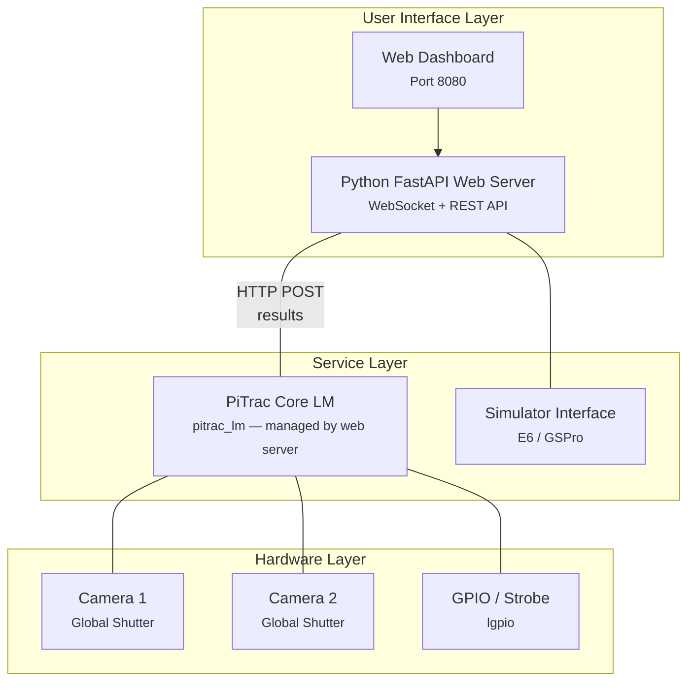
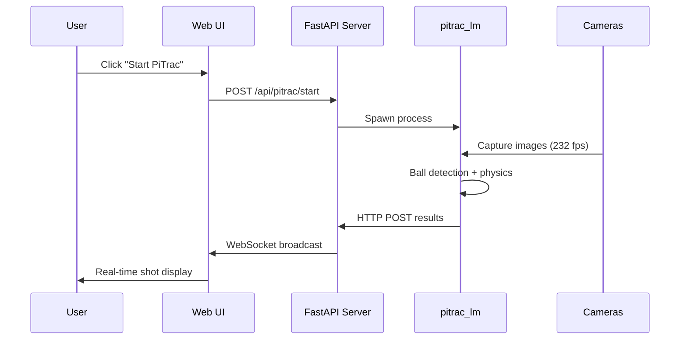

# System Overview

Understanding PiTrac's architecture is essential for effective development. This document covers the system's components, their interactions, and the design decisions that shape the project.

## Architecture

PiTrac uses a web-first architecture where all user interaction happens through a modern web interface. The system balances performance requirements with user experience through careful separation of concerns.



!!! note
    Shot results are sent from `pitrac_lm` to the web server via HTTP POST. ActiveMQ has been removed from the architecture.

## Core Components

### Web Dashboard

The modern Python-based web interface that replaces all CLI and manual operations:

- **FastAPI Framework** -- High-performance async web server
- **WebSocket Support** -- Real-time updates without polling
- **Process Management** -- Start/stop PiTrac processes dynamically
- **Configuration UI** -- Graphical configuration with validation
- **Testing Suite** -- Hardware and system tests with live feedback
- **Calibration Wizard** -- Step-by-step camera calibration
- **Log Streaming** -- Real-time log viewing and filtering

Key files in `Software/web-server/`:

| File | Purpose |
|------|---------|
| `server.py` | FastAPI application and routes |
| `managers.py` | Shot and session management |
| `config_manager.py` | Python configuration handler |
| `static/js/` | Frontend JavaScript (vanilla JS, no framework) |
| `templates/` | Jinja2 HTML templates |

### PiTrac Launch Monitor Core (`pitrac_lm`)

The C++ binary that performs the actual image processing:

- **Image Acquisition** -- Interfaces with Pi cameras through libcamera
- **Ball Detection** -- Real-time computer vision using OpenCV
- **Physics Calculation** -- 3D trajectory computation from stereo images
- **Result Reporting** -- Sends results via HTTP POST to the web server

Key source files in `Software/LMSourceCode/ImageProcessing/`:

| File | Purpose |
|------|---------|
| `ball_image_proc.cpp` | Main image processing pipeline |
| `gs_fsm.cpp` | Finite state machine for shot detection |
| `pulse_strobe.cpp` | Hardware strobe synchronization |
| `configuration_manager.cpp` | Configuration handling |

### Configuration Management

A three-tier configuration system managed through the web UI:

1. **System Defaults** -- Built into the application
2. **Calibration Data** -- Camera-specific calibration parameters
3. **User Overrides** -- Settings changed through web UI

Configuration flow:

```
Web UI Changes --> REST API --> YAML Files --> ConfigurationManager --> pitrac_lm
```

Key locations:

- `~/.pitrac/config/` -- User configuration (managed by web UI)
- `configuration_manager.cpp` -- C++ configuration logic
- `Software/web-server/config_manager.py` -- Python configuration handler

### Process Architecture

PiTrac uses dynamic process management rather than traditional services:

```python
# Web server manages PiTrac processes
class PiTracManager:
    def start_camera(self, camera_num):
        # Build command from web UI configuration
        cmd = self.build_command(camera_num)
        # Spawn process (not a service)
        process = subprocess.Popen(cmd)
        # Monitor health
        self.monitor_process(process)

    def stop_camera(self, camera_num):
        # Graceful shutdown via signals
        self.send_shutdown_signal(camera_num)
```

## Data Flow

### Shot Detection Flow



### Configuration Update Flow

1. User modifies setting in web UI
2. Frontend validates input
3. REST API updates configuration
4. YAML file written to disk
5. User clicks "Restart PiTrac" if needed
6. Web server stops old process
7. New process started with updated config

## Technology Stack

### Frontend

| Technology | Purpose |
|-----------|---------|
| Vanilla JavaScript | No framework dependencies |
| WebSocket | Real-time updates |
| Responsive CSS | Mobile-friendly |
| Jinja2 Templates | Server-side rendering |

### Backend

| Technology | Purpose |
|-----------|---------|
| Python 3.9+ | Web server runtime |
| FastAPI | Modern async framework |
| subprocess | Process management |

### Core Processing

| Technology | Purpose |
|-----------|---------|
| C++20 | Modern C++ features |
| OpenCV 4.13.0 | Computer vision |
| NCNN | Neural network inference (YOLO) |
| libcamera | Camera interface |
| Boost >= 1.74.0 | Utilities and testing |

### Infrastructure

| Technology | Purpose |
|-----------|---------|
| systemd | Service management (web server only) |
| Meson/Ninja | Build system |
| Bashly | CLI generation |

## Design Principles

### Web-First Approach

- All user interaction through web UI
- No manual configuration file editing required
- Real-time feedback and monitoring

### Process Management

- Dynamic process spawning (not services for the LM)
- User-initiated control via web dashboard
- Graceful error handling and health monitoring

### Configuration Philosophy

- GUI-based configuration through web UI
- Live validation and feedback
- Settings organized by category (cameras, detection, simulators, etc.)

## Development Workflow

1. **Code Changes** -- Edit source files
2. **Rebuild** -- `sudo ./build.sh dev` in `packaging/`
3. **Web Server Auto-Updates** -- Automatically uses new code
4. **Test via Web UI** -- Use the Testing section at port 8080
5. **Monitor Logs** -- View in web UI Logs section

### Key Development Areas

| Area | Location | Language |
|------|----------|----------|
| Web Interface | `Software/web-server/` | Python / JavaScript |
| Core Processing | `Software/LMSourceCode/ImageProcessing/` | C++ |
| Build System | `packaging/` | Bash / Docker |
| Configuration | Through web UI | -- |
