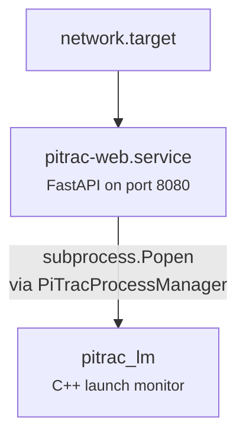

# Service Architecture

PiTrac runs a single systemd service — `pitrac-web.service` — which serves the web UI and manages the `pitrac_lm` launch monitor process on demand.

## Architecture



| Component | How it runs | Managed by |
|-----------|------------|------------|
| `pitrac-web.service` | systemd service — always running | `systemctl` |
| `pitrac_lm` | Child process of web server | Web UI Start/Stop buttons |

## pitrac-web.service

The only systemd service. Template at `packaging/templates/pitrac-web.service.template`:

```ini
[Unit]
Description=PiTrac Web Server
After=network.target multi-user.target

[Service]
Type=simple
Nice=10
CPUWeight=50
MemoryMax=512M
User=@PITRAC_USER@
Group=@PITRAC_GROUP@
DynamicUser=no
AmbientCapabilities=CAP_SYS_NICE
WorkingDirectory=/usr/lib/pitrac/web-server
Environment="HOME=@PITRAC_HOME@"
Environment="USER=@PITRAC_USER@"
Environment="PATH=/usr/bin:/usr/local/bin"
Environment="PYTHONPATH=/usr/lib/pitrac/web-server"
ExecStart=/usr/bin/python3 /usr/lib/pitrac/web-server/main.py
Restart=always
RestartSec=10
StandardOutput=journal
StandardError=journal
SyslogIdentifier=pitrac-web

[Install]
WantedBy=multi-user.target
```

!!! info "CAP_SYS_NICE"
    `AmbientCapabilities=CAP_SYS_NICE` grants the spawned `pitrac_lm` process permission to use `SCHED_FIFO` for the motion detection trigger path. This uses ambient capabilities instead of file capabilities (`setcap`) to avoid setting `AT_SECURE`, which would break libcamera's `secure_getenv()` config file reading.

### Installation

During `sudo ./build.sh dev`, the service is installed by `web-service-install.sh`:

1. Template copied to `/usr/share/pitrac/templates/`
2. `web-service-install.sh install <username>` processes the template — replaces `@PITRAC_USER@`, `@PITRAC_GROUP@`, `@PITRAC_HOME@`
3. Service file placed at `/etc/systemd/system/pitrac-web.service`
4. `systemctl daemon-reload` applied

### Management

```bash
sudo systemctl start pitrac-web
sudo systemctl stop pitrac-web
sudo systemctl status pitrac-web
sudo systemctl enable pitrac-web   # Start on boot
journalctl -u pitrac-web -f        # Stream logs
```

## PiTracProcessManager — pitrac_lm Lifecycle

The web server manages the `pitrac_lm` process through `PiTracProcessManager` in `pitrac_manager.py`.

### Start sequence

1. Check not already running (via PID file + `/proc/<pid>/cmdline`)
2. Generate runtime config via `ConfigurationManager.generate_golf_sim_config()` → writes `~/.pitrac/config/generated_golf_sim_config.json`
3. Build command line from configuration metadata — maps web UI settings to CLI args for `pitrac_lm`
4. Set environment: `LD_LIBRARY_PATH=/usr/lib/pitrac`, `OMP_WAIT_POLICY=PASSIVE`, image/share directories
5. Spawn with `subprocess.Popen` using `preexec_fn=os.setsid` (own process group)
6. Write PID to `~/.pitrac/run/pitrac.pid`
7. Wait `startup_delay` seconds (default: 3), check process didn't exit

### Stop sequence

1. Read PID from file, verify process exists
2. Send `SIGTERM` to process group via `os.killpg`
3. Poll for `shutdown_grace_period` seconds (default: 5)
4. If still alive, send `SIGKILL`
5. Clean up PID file

### Key paths

| File | Purpose |
|------|---------|
| `~/.pitrac/run/pitrac.pid` | PID tracking |
| `~/.pitrac/logs/pitrac.log` | Process stdout/stderr |
| `~/.pitrac/config/generated_golf_sim_config.json` | Generated runtime config |
| `/usr/lib/pitrac/pitrac_lm` | The binary |

## Migration Cleanup

When running `sudo ./build.sh dev`, the build script automatically:

- Stops and removes any old `pitrac.service` (from pre-web-UI versions)
- Kills lingering `pitrac_lm` processes
- Cleans up stale PID and lock files from `~/.pitrac/run/`
- Releases GPIO resources (GPIO 25 for pulse strobe)

## Troubleshooting

```bash
# Is the web server running?
systemctl status pitrac-web

# Is port 8080 in use?
ss -tln | grep 8080

# Web server logs
journalctl -u pitrac-web -n 100 --no-pager

# Is pitrac_lm running?
pgrep pitrac_lm

# Force kill if stuck
sudo pkill -9 pitrac_lm

# Stale PID files?
ls ~/.pitrac/run/
rm ~/.pitrac/run/*.pid
```
