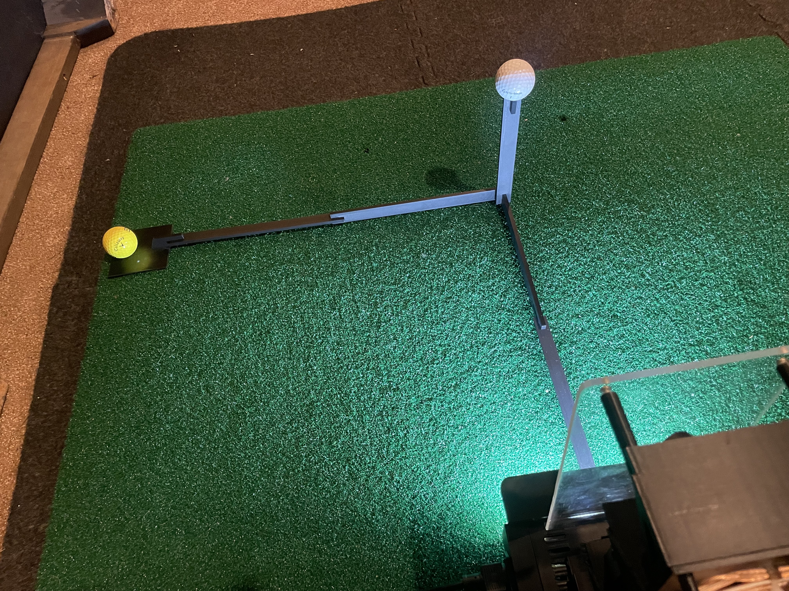
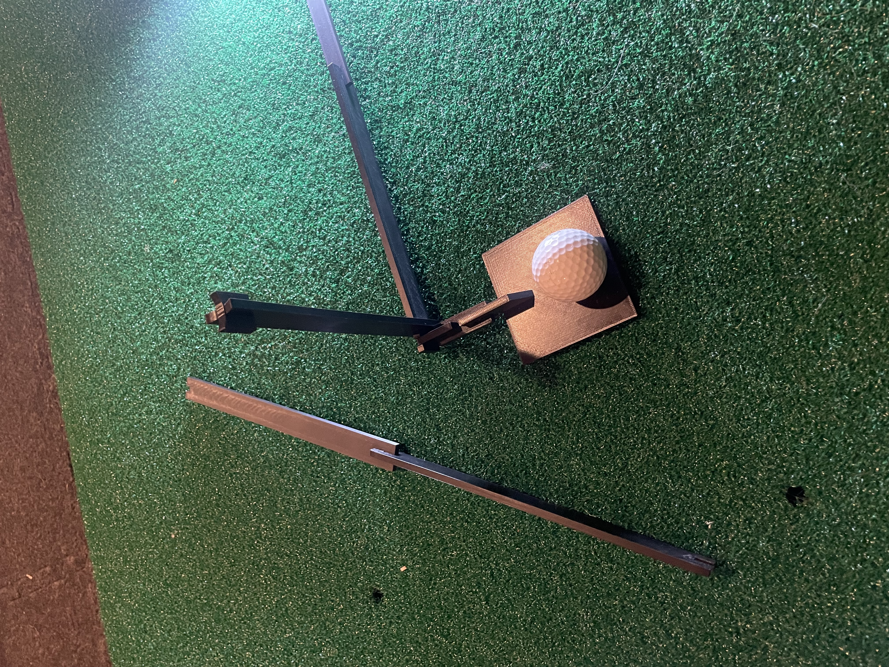
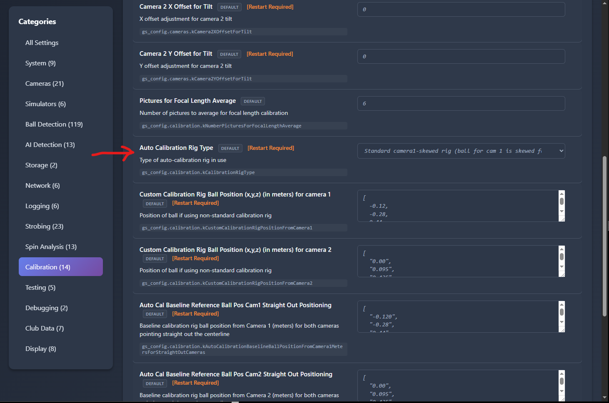

# Auto-Calibration

Auto-calibration is the recommended way to calibrate PiTrac cameras. It automatically determines focal lengths and camera angles through a 4-step web wizard -- no tape measures, no manual JSON editing, no shell scripts. These measurements are used by PiTrac during operation to determine the location of the ball in real space relative to the unit.

!!! warning "Run Distortion Correction first"
    Do **[Distortion Correction](distortion-correction.md)** before auto-calibration. Every camera-based measurement in PiTrac -- focal length, camera angles, ball position, ball flight -- is degraded by uncorrected lens distortion, especially near the frame edges where much of the interesting ball physics happens. Auto-calibration measures ball positions from images, so if those images are still warped, the focal length and angles it computes will be biased.

    Distortion calibration is a one-time-per-lens step and takes a few minutes. Do it first.

## What Auto-Calibration Does

**Calculates automatically**:

- **Focal length** for each camera (in pixels, typically 800-1200 for 6mm lens)
- **Camera angles** (X and Y tilt in degrees)

**Writes to configuration**:

- Updates `~/.pitrac/config/calibration_data.json` with results
- Preserves these values across config resets
- No manual file editing required

!!! note "Previous method (deprecated)"
    Manual measurements, Excel spreadsheets, tape measures, angle calculations by hand. If you are still doing that, stop. Use auto-calibration instead.

---

## Physical Setup

Before you can run auto-calibration in the web UI, you need a calibration rig to hold golf balls at known positions.

### 1. Print the Calibration Rig

**Files**: [GitHub - Calibration Rig STL files](https://github.com/PiTracLM/PiTrac/tree/main/3D%20Printed%20Parts/Enclosure%20Version%202/Calibration%20Rig)

The rig works with V1.0, 2.0, and StefanF's 3.0 enclosures, though V1 is not as well-supported and may need custom measurements (ask on Discord). Only difference is the measurement values you will configure. Because V3.0 is still under development, these values may need to be updated from time to time.

**Print Settings**:

- **Material**: PETG preferred (less warping), PLA works fine
- **Infill**: 15% standard
- **Supports**: Only on the Ball 1 floor mount (green area in STL)
- **Filament**: < 100 grams

**Assembly**:

The assembly process depends on whether your PiTrac has both cameras pointed straight forward, or if Camera 1 (the "Teed Ball Camera") is angled to the side to accommodate faster shots.

The skewed version looks like this:

{ width="300" }

The cameras-straight-out version replaces the long arm with two short pieces and looks like this:

{ width="300" }

- Push pieces together snugly (can be tight -- that is normal)
- Make sure connections are fully seated for accurate dimensions

!!! warning
    Ball 1 (right-most) sits on the floor, Ball 2 is held mid-air. Only place **one** ball at a time during calibration or the system will get confused.

### 2. Position the Rig

=== "V2.0 / V3.0 Enclosure"

    - Insert the square tab into the square hole in bottom front of enclosure. You may need to nudge the LED light strip to get at the hole.
    - Check that rig is square to the enclosure and that the arm for the ball on the floor is 90 degrees to the other leg. Also ensure the ball in the air is held straight up.

=== "V1.0 Enclosure (Deprecated)"

    - Center tab underneath lowest camera
    - Place tab on diagonal part of enclosure
    - Align end edge of rear part with outside of lower enclosure section

!!! tip
    Use a carpenter's square or similar to ensure the rig is perpendicular to the enclosure. Precision here improves calibration accuracy.

### 3. Aim the Cameras

**Camera 1** (Tee Camera):

- Point directly at Ball 1 (on floor). For straight-out camera, move the camera slightly so it is still aimed down, but aimed straight out along the leg of the rig that attaches to the PiTrac.
- Does not need to be perfect -- calibration figures out the exact angle. Just get it close.

**Camera 2** (Flight Camera):

- Point straight out from monitor
- Aim slightly below Ball 2 (mid-air ball)
- Again, close is fine

!!! warning
    **Tighten camera mount screws** once aimed. Cameras moving after calibration means you need to recalibrate.

### 4. Configure Ball Positions

The calibration wizard needs to know where the balls are relative to the cameras. These measurements (for each of the "standard" rig setups) are already stored in the system settings for each camera, and can be selected or modified in the Configuration page under "Calibration" settings.

Use the UI to select one of the three calibration rig options:

=== "V1.0 Enclosure (Skewed Rig)"

    ```
    kAutoCalibrationBallPositionFromCamera1Meters: [-0.525, -0.275, 0.45]
    kAutoCalibrationBallPositionFromCamera2Meters: [0.0, 0.095, 0.435]
    ```

=== "V2.0 Enclosure (Skewed Rig)"

    ```
    kAutoCalibrationBallPositionFromCamera1Meters: [-0.504, -0.234, 0.491]
    kAutoCalibrationBallPositionFromCamera2Meters: [0.0, 0.088, 0.466]
    ```

=== "V3.0 Enclosure (Skewed Rig)"

    ```
    kAutoCalibrationBallPositionFromCamera1Meters: [-0.521, -0.243, 0.481]
    kAutoCalibrationBallPositionFromCamera2Meters: [0.0, 0.109, 0.472]
    ```

**Coordinate system**:

- **X**: Positive = right (from camera view)
- **Y**: Positive = up
- **Z**: Positive = outward (away from camera)
- **Units**: Meters

If you built your own rig, measure from camera lens center to ball center and enter those values.

!!! note
    These settings are in the **web Configuration page** -- you do not need to edit JSON files manually.

---

## Running Auto-Calibration (Web UI)

### Step 1: Open Calibration Wizard

1. Select the type of calibration rig you will be using (depending on camera arrangement and enclosure version) in **Configuration > Calibration > kCalibrationRigType**:

    { width="300" }

2. Navigate to the PiTrac web dashboard (usually `http://raspberrypi.local:8080`) where `raspberrypi` is the name of your Pi on the network, e.g., `http://192.168.0.20:8080`.
3. Click menu (3 dots) > **Calibration**
4. Select which camera(s) to calibrate:
    - [x] **Camera 1** -- Recommended starting point (~30 seconds)
    - [ ] **Camera 2** -- Do this second (~2 minutes, yes really)
    - [ ] **Both** -- Only after you have done each individually

!!! tip
    **Calibrate Camera 1 first.** It is faster and gives you immediate feedback if something is wrong.

Click **Next**.

### Step 2: Verify Ball Placement

This step confirms PiTrac can actually see the ball before trying to calibrate.

**For each camera**:

1. Click **Check Ball Location**
    - Green status = Ball found at (X, Y) pixel coordinates
    - Red status = Ball not detected

2. Click **Calibrate Camera [N]**
    - Runs auto-calibration for that camera
    - Displays the calibration image if available
    - Ball should be visible in the image

??? note "Ball detection failing?"
    - Check the images that the process captures (usually at `~/LM_Shares/Images`)
    - Check the latest log files for errors (`~/.pitrac/logs`) -- see the [Files and Logs reference](../../reference/files-and-logs.md) for everywhere PiTrac writes
    - Check lighting (turn on strobes, adjust camera gain in **Configuration**)
    - Verify ball is actually on the rig
    - Make sure camera is aimed at ball
    - Check focus

Once both buttons show success, click **Next**.

### Step 3: Run Calibration

Pick calibration method:

**Auto Calibration** (Recommended)

- Fully automatic
- Click "Start Auto Calibration"
- Watch progress bar
- Wait for completion

**Manual Calibration** (Advanced)

- For troubleshooting when auto fails
- Same process but longer timeout (3 minutes vs 30-120 seconds)
- Rarely needed

!!! warning "During calibration, do NOT:"
    - Move the ball
    - Move the cameras
    - Close the browser
    - Stop PiTrac while calibrating

??? note "What happens during calibration (technical details)"

    **Camera 1** (~30 seconds):

    1. Captures 10 images of the ball (configurable)
    2. Detects ball center in each image using Hough Circle Transform
    3. Calculates focal length from: `f = (distance x sensor_width x (2 x radius_px / resolution_x)) / (2 x ball_radius_m)`
    4. Averages focal lengths across all successful samples
    5. Validates result (focal length must be 2.0-50.0mm, radius 0-10k pixels)
    6. Computes camera X and Y angles using final focal length
    7. Sends results to web server via HTTP API
    8. Updates configuration files

    **Camera 2** (~90-120 seconds):

    - Same algorithm as Camera 1
    - Takes longer due to two-process workflow in single-Pi mode:
        - Background process captures images from Camera 2
        - Foreground process performs calibration
        - Background must initialize before foreground starts (adds ~30 seconds)

??? note "Completion detection (technical details)"

    The system uses a hybrid approach to detect when calibration finishes:

    1. **API Callbacks** (Primary) -- C++ binary sends HTTP PUT requests when successful:
        - `PUT /api/config/gs_config.cameras.kCamera1FocalLength` (focal length value)
        - `PUT /api/config/gs_config.cameras.kCamera1Angles` (X, Y angles array)
        - Both must be received for success

    2. **Process Exit** (Secondary) -- Monitors C++ process exit code
        - Code 0 = potential success (but may have failed internally)
        - Non-zero = definite failure

    3. **Output Parsing** (Validation) -- Checks for failure strings in output:
        - `Failed to AutoCalibrateCamera`
        - `NCNN detection failed - no balls found`
        - `GetBall() failed to get a ball`
        - `Could not DetermineFocalLengthForAutoCalibration`

    4. **Timeout** (Safety Net)
        - Camera 1: 30 seconds
        - Camera 2: 120 seconds
        - Prevents hanging forever if process stalls

    **Progress Indicators**:

    - **API Callbacks Received** -- Best outcome, all data received
    - **Process Exit** -- Process finished but may not have sent API callbacks
    - **Timeout** -- Process did not complete in time, check logs

### Step 4: Review Results

You will see results for each camera:

**Status**: Success or Failed

**Completion Method**: How calibration finished

- `api` -- API callbacks received (best)
- `process` -- Process exited cleanly
- `timeout` -- Took too long (check logs)

**Focal Length**: Number in pixels (e.g., `1025.347`)

- Typical range for 6mm lens: 800-1200
- If way outside this range, something is wrong

**Camera Angles**: `[X_angle, Y_angle]` in degrees (e.g., `[12.45, -6.78]`)

- X angle: Horizontal tilt
- Y angle: Vertical tilt
- Typical range: -20 to +20 degrees

**What to do**:

- Success? Click "Return to Dashboard" and test it out
- Failed? Check the troubleshooting section below

---

## Verification

After calibration, verify it worked:

### Ball Location Check

**From web UI** (Testing Tools):

1. Leave ball on rig
2. Navigate to Testing Tools
3. Click "Check Ball Location" for Camera 1

**Expected**: Ball position in 3D should match your configured calibration position (within ~10mm)

**Example**:

| | X | Y | Z |
|---|---|---|---|
| Configured | -0.525 | -0.275 | 0.450 |
| Detected | -0.523 | -0.271 | 0.448 |
| Difference | 2mm | 4mm | 2mm |

A difference within ~10mm is good. If detected position is way off (>50mm difference), calibration likely failed even if it reported success.

### Test Shots

Hit some balls and check if speeds and angles look reasonable:

- **Driver swing**: 80-120 mph ball speed
- **7-iron swing**: 60-90 mph ball speed
- **Launch angles**: 5-20 degrees depending on club

!!! warning
    If you are getting 300 mph or 5 mph, calibration is wrong. Recalibrate.

---

## Troubleshooting

??? note "Ball not detected in Step 2"

    **Lighting Issues**:

    - Turn on strobes (you should hear them click)
    - Increase camera gain in **Configuration > Cameras > kCamera1Gain** (try 8-12)
    - Make sure room is not too bright (IR strobes work better in darker rooms)

    **Focus Issues**:

    - Twist M12 lens focus ring
    - Capture still images to check focus
    - Ball should have sharp edges, not blurry

    **Positioning Issues**:

    - Verify ball is actually on rig
    - Check camera is aimed at ball
    - Make sure nothing is blocking camera view

??? note "Calibration times out"

    **Camera 1** (should take ~30 seconds):

    - Ball moved during calibration? Try again, keep it still
    - Camera type set wrong? Check **Configuration > Cameras > Auto Detect**
    - Check logs (Logs page) for errors

    **Camera 2** (should take 90-120 seconds):

    - **This is normal.** Camera 2 legitimately takes 2 minutes. Be patient.
    - Background process needs time to initialize and capture images
    - If it goes past 2 minutes, check logs for errors

    **Both Cameras**:

    - System overloaded? Check `top` on Pi -- CPU should not be at 100%
    - Try manual calibration mode (longer timeout, may succeed)

??? note "Results look wrong"

    **Focal length way off** (< 800 or > 1200 for 6mm lens):

    - Wrong lens type configured? Check **Configuration > Cameras > Lens Choice**
    - Measured ball positions wrong? Verify rig measurements
    - Ball detection failing? Check captured images in Testing Tools

    **Angles look weird** (> 30 degrees off from expected):

    - Cameras moved during calibration
    - Rig not square to enclosure
    - Wrong enclosure version measurements (V1.0 vs V2.0)

    **Speed readings wrong after calibration**:

    - Ball position measurements incorrect
    - Try recalibrating with verified measurements
    - Check if ball moved between calibration attempts

??? note "Calibration succeeds but doesn't apply"

    **Check**:

    - Calibration data should be in `~/.pitrac/config/calibration_data.json`
    - Restart PiTrac LM (Stop/Start in web UI)
    - Configuration > show focal length/angles -- should match calibration results

    **If still using old values**:

    - User settings may be overriding calibration data
    - Check **Configuration > Show Diff** to see what is overridden
    - Remove camera angle/focal length entries from user settings if present

---

## Configuration Files

Auto-calibration writes to these locations:

**Calibration Results**: `~/.pitrac/config/calibration_data.json`

```json
{
  "gs_config": {
    "cameras": {
      "kCamera1FocalLength": 1025.347,
      "kCamera1Angles": [12.45, -6.78],
      "kCamera2FocalLength": 1050.123,
      "kCamera2Angles": [8.7, -3.1]
    }
  }
}
```

**Backups**: Old config backed up to `~/.pitrac/config/calibration_data.json.backup.<timestamp>`

**Runtime Config**: Results merged into `~/.pitrac/config/generated_golf_sim_config.json` (what the C++ binary reads)

!!! note
    You never need to edit these manually. The web UI handles everything.

---

## Advanced Topics

??? note "Number of Samples"

    **Default**: 10 images per camera

    **Adjust**: **Configuration > Calibration > kNumberPicturesForFocalLengthAverage**

    **Trade-off**:

    - More samples = more accurate but slower
    - Fewer samples = faster but may be less accurate
    - 10 is a good balance

??? note "Custom Calibration Rigs"

    If you built your own rig:

    1. Measure from camera lens center to ball center (X, Y, Z in meters)
    2. Enter in **Configuration > Calibration**:
        - `kAutoCalibrationBallPositionFromCamera1Meters`
        - `kAutoCalibrationBallPositionFromCamera2Meters`
    3. Run calibration wizard

    **Measurement tips**:

    - Use CAD software (FreeCAD, Fusion 360) for precision
    - Measure to center of ball, not edge
    - Measure from lens center, not camera front
    - Use meters, not inches or millimeters

??? note "Lens Distortion"

    Auto-calibration does **not** correct for lens distortion -- it determines focal length and camera angles only. Lens distortion is handled by [Distortion Correction](distortion-correction.md), which must be done **before** auto-calibration (see the warning at the top of this page).

---

## When to Recalibrate

**Required**:

- [ ] First time setup
- [ ] After moving cameras
- [ ] After changing lenses
- [ ] After dropping/bumping enclosure

**Not required**:

- Every time you use PiTrac
- After adjusting camera gain
- After tweaking ball detection settings
- After software updates

Calibration data persists across reboots and config changes. Do not recalibrate unless you have a reason.

---

## Next Steps

1. **Calibrate Camera 1** -- Takes 30 seconds
2. **Calibrate Camera 2** -- Takes 2 minutes
3. **Verify results** -- Check ball location matches expected position
4. **Test shots** -- Hit some balls, verify speeds look reasonable
5. **Fine-tune** -- Adjust gain, search center, etc. as needed

Good calibration is the foundation of accurate ball tracking. Take your time with the physical setup -- it is worth it.
