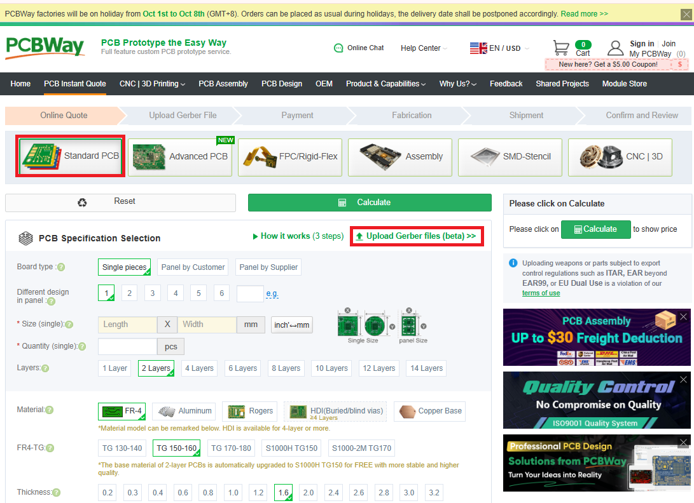
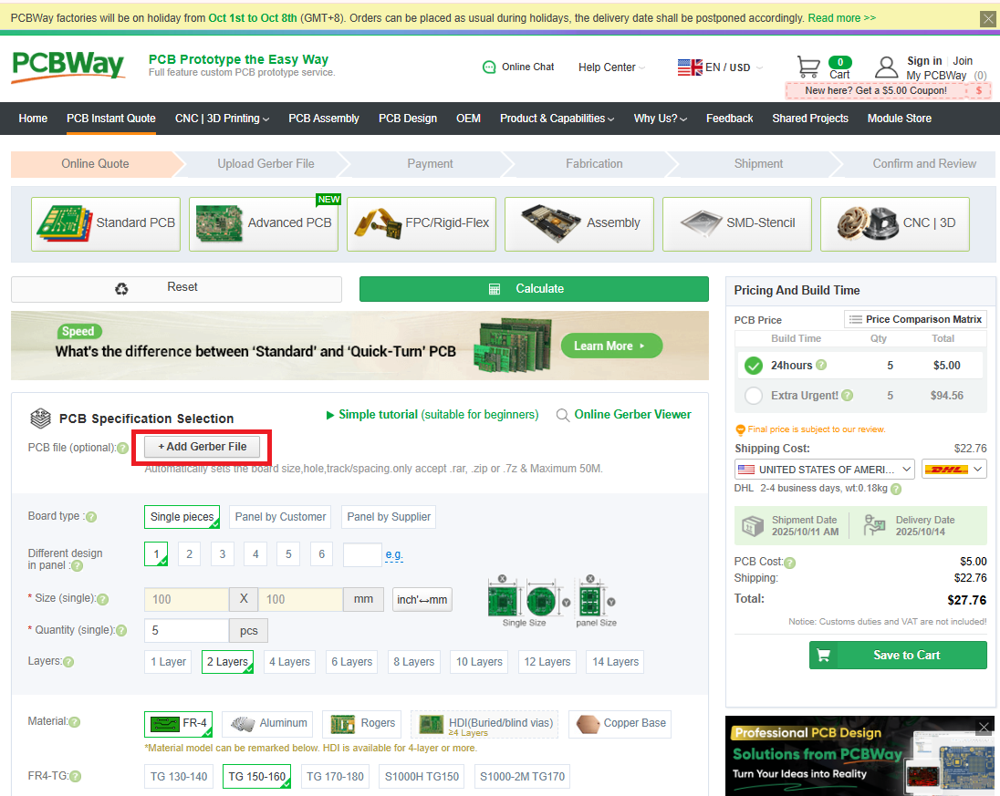
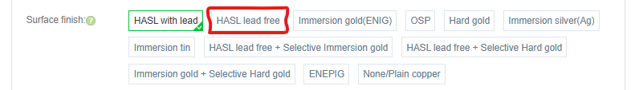
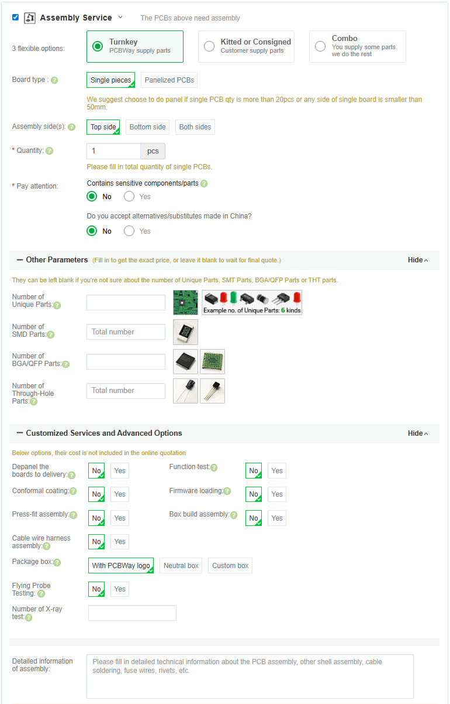
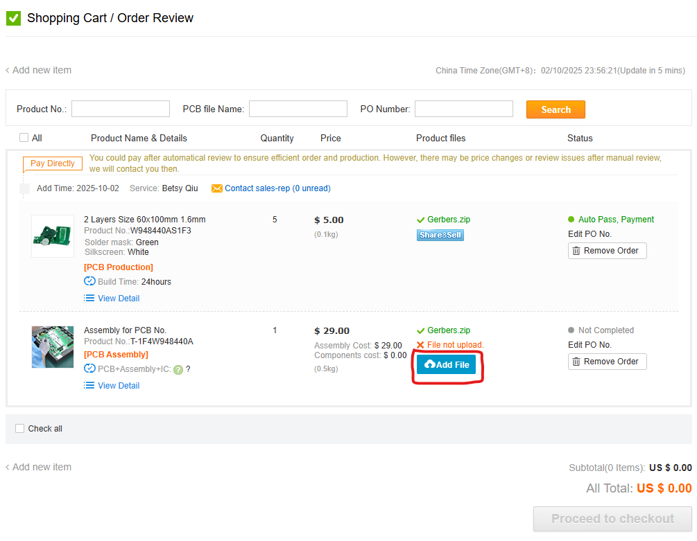
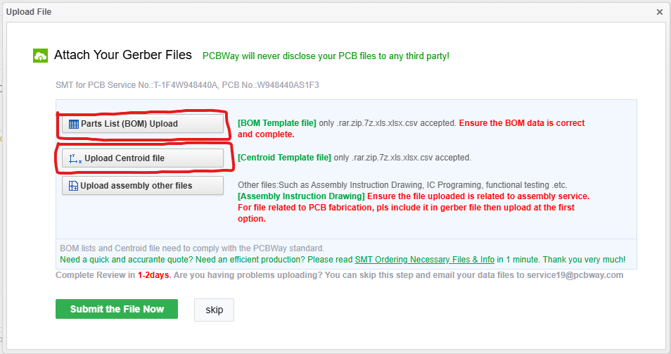
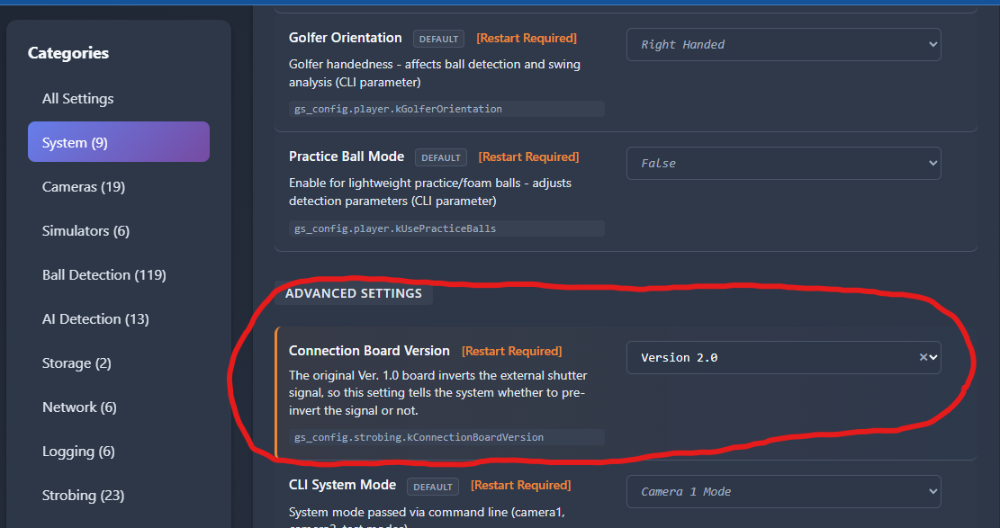

# Connector Board

The Connector Board is the central hub of your PiTrac. It handles connections between the Raspberry Pi computers and the strobe light while also providing regulated power for the IR LED array.

## V3 Connector Board (Current)

The V3 Connector Board uses all through-hole construction for easier hand assembly.

**Key features:**

- All through-hole construction
- Removed ineffective 555 timer circuit from V2
- Full control of LED current including ADC for calibration

!!! note "Legacy boards"
    V3 replaces the V2 Dual Pi5 Connector Board, which used a mix of SMD and through-hole components with dual 555 timers for duty cycle control. The original V1 board used separate AC/DC supplies with opto-coupler isolation. If you have a V1 or V2 board, they still work -- just select the correct board version in the PiTrac configuration UI.

## IRLED Board

The custom IRLED board replaces the original LED array, which has become expensive and challenging to source. It uses LEDs available in distribution.

### IRLED2 (Current)

Fixed footprint mistake from the original IRLED revision for a last-minute LED change.

!!! note "Original IRLED"
    The original IRLED board only works with the more expensive LED PN SST-10-IRD-B90H-S810 ([DigiKey](https://www.digikey.com/en/products/detail/luminus-devices-inc/SST-10-IRD-B90H-S810/13557593)). Uses 10 LEDs in a 5S2P configuration. Use IRLED2 for new builds.

## Ordering the PCB

### Where to Order

Any decent PCB fabricator can make this board. Two popular options:

- **JLCPCB** -- <https://jlcpcb.com>
- **PCBway** -- <https://www.pcbway.com>

Both have easy file upload and offer assembly services.

!!! tip "Save money"
    Check the Discord `#pitrac-stuff-for-sale` channel before ordering. Community members often have spare boards at cost.

### Fabrication and Assembly Files

There are three different PCB filesets. The combined PCB has two BOM variants determining how much of the assembly you want done by the vendor. For smaller order quantities (without assembly) the separate PCB files are likely to be cheaper.

#### V3 Connector Only

```
Hardware/Fabrication Files/V3 Connector Only Gerbers.zip
```

!!! warning "Assembly of V3 Connector with vendor not recommended"
    The V3 Connector is entirely through-hole and straightforward to assemble by hand. Vendor assembly is not recommended.

```
Hardware/Assembly Files/V3 Connector Only/V3 Connector Only Assembly/*
```

#### IRLED2 Only

```
Hardware/Fabrication Files/IRLED2 Only Gerbers.zip
```

```
Hardware/Assembly Files/IRLED2 Only/IRLED2 Only Assembly/*
```

#### V3 Connector + IRLED2

There are two BOM variants due to it being a panel of two PCBs. It is recommended that you only use an assembler for the surface mount IR LEDs. It is more cost effective generally to purchase the components and assemble the entirely through-hole V3 connector by yourself.

```
Hardware/Fabrication Files/V3 Connector + IRLED2 Gerbers.zip
```

**Assemble IRLED2 (Recommended)**

```
Hardware/Assembly Files/V3 Connector + IRLED2/IRLED2 Assembly/*
```

**Assemble V3 Connector + IRLED2**

!!! warning "Assembly of V3 Connector with vendor not recommended"
    The V3 Connector is entirely through-hole and straightforward to assemble by hand. Vendor assembly is not recommended.

```
Hardware/Assembly Files/V3 Connector + IRLED2/V3 Connector + IRLED2 Assembly/*
```

### Ordering Process

1. **Upload the Gerbers** -- Upload `Gerbers.zip` to JLCPCB or PCBway

    

    

2. **Board specs** -- Update the following attribute:
    - Thickness: 0.8mm

3. **Surface Finish** -- Ensure set to "HASL Lead-Free"

    

    Use lead-free solder for assembly, so get a lead-free board finish.

4. **Quantity** -- Minimum order is usually 5 boards. Only 1 V3 Connector and 1 IRLED are required for a PiTrac build.

### Assembly Service (Optional)

Don't want to solder? Both JLCPCB and PCBway offer assembly services.

Select Assembly Service:



The fab house sources components, solders everything, and ships you a completed board. Costs more, but saves significant time.

Once you have added the board with assembly to your cart you will need to provide the information they need for assembly.





## Component Sourcing

### Bill of Materials

Complete BOM with DigiKey links: [Parts List](parts-list.md)

## Assembly

### Difficulty Assessment

**Skill Level:** Beginner / Intermediate

**Time estimate:**

- First build: 2-4 hours
- With experience: 1-2 hours

If you're a true novice at soldering, some of it will take time.

### Assembly Tips

1. **Order matters:**
    - DIP-8 Packages first (U1, U3, U5, U6)
    - Resistors
    - Capacitors
    - MOSFETs, LDO etc.
    - Connectors

2. **Before power-up:**
    - Check for solder bridges with multimeter
    - Verify no shorts between power and ground
    - Double-check component orientation (ICs, diodes, polarized caps)

## Board Configuration

After assembly, you must run current calibration before you will be able to capture shots.

### Test Points

| Test Point | Signal                           |
| ---------- | -------------------------------- |
| **TP2**    | Ground reference (use for all DC measurements) |
| **TP1**    | +5V Input                        |
| **TP3**    | LDO Output                       |
| **TP4**    | Current Sense                    |
| **TP5**    | Gate Drive / Strobe Input        |
| **TP6**    | DAC Output Voltage               |

## Connections

### Power Input

- **J1:** 5V input from Meanwell LRS-75-5 (screw terminals)

### Power Output

- **J2/J5:** USB-C ports for Pi power (5V)

### Pi GPIO

- **J3:** 8-pin GPIO header for control signals (see Connection Guide below)

### LED Output

- **J4:** Regulated high-voltage output to IR LED array (screw terminals)
- Current adjustable with DAC (U5)

### Optional

- **J6 (USB-A):** Originally for LED strip, but Pi5 has USB 2.0 ports already -- this is redundant

## Connection Guide for Raspberry Pi 5

| V3 Connector Board | Raspberry Pi 5     |
| ------------------- | ------------------ |
| GND                 | GND (Pin 39)       |
| DIAG                | GPIO 10 (Pin 19)   |
| CS0                 | GPIO 18 (Pin 12)   |
| MOSI                | GPIO 20 (Pin 38)   |
| MISO                | GPIO 19 (Pin 35)   |
| CLK                 | GPIO 21 (Pin 40)   |
| CS1                 | GPIO 17 (Pin 11)   |
| V3P3                | 3V3 (Pin 1)        |

| Global Shutter Camera 2 | Raspberry Pi 5     |
| ------------------------ | ------------------ |
| Trig+                    | GPIO 25 (Pin 22)   |
| Trig-                    | GND (Pin 20)       |

| V3 Connector Board | V3 IRLED Board |
| ------------------- | -------------- |
| VIR+                | VIR+           |
| VIR-                | VIR-           |


## Configuring PiTrac

You'll need to tell PiTrac which version of the Connection Board you are using. This is done in the Configuration screen in the UI.

Before you run the PiTrac system for the first time, set the board type appropriately here:



!!! note
    The current default value is for the Version 1.0 board. Make sure to update this to V3 for new builds.

## Design Files

Full design documentation:

```
Hardware/KiCad Source Files/*
```

KiCad files are editable if you want to modify the design.
