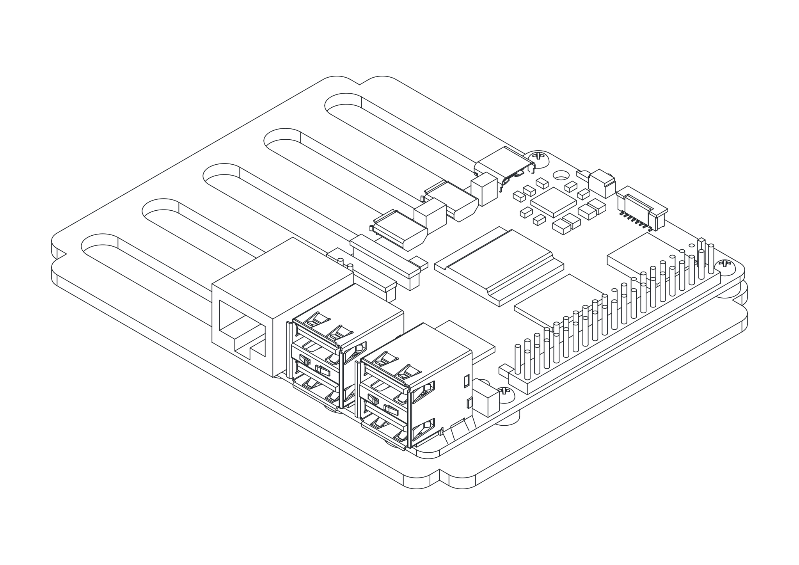

# Electronics

Mount the Pi 5 and the V3 Connector Board on their respective 3D-printed carriers. The carriers slide into the inner-most slots of the stack modules during [Final Assembly](installation.md).

---

## Pi 5 and Connector Board Carriers

=== "Pi 5 Carrier (3D)"

    { .assembly-diagram }

=== "Pi 5 Carrier (Drawing)"

    { .assembly-diagram }

=== "Connector Board (3D)"

    { .assembly-diagram }

=== "Connector Board (Drawing)"

    { .assembly-diagram }

Tools:

- Cross-head screwdriver

| Part | Qty | Notes |
|------|-----|-------|
| [Pi5_Carrier_vertical_3mm.stl](https://github.com/PiTracLM/PiTrac/raw/main/3D%20Printed%20Parts/Enclosure%20Version%203/Part/Print/Pi5_Carrier_vertical_3mm.stl){ .stl-download } | 1 | choose height and hole version according to your setup (NVMe, HDMI access, etc.) |
| [ConnectorBoardv3_Carrier.stl](https://github.com/PiTracLM/PiTrac/raw/main/3D%20Printed%20Parts/Enclosure%20Version%203/Part/Print/ConnectorBoardv3_Carrier.stl){ .stl-download } | 1 | |
| Pi 5 | 1 | |
| ConnectorBoardv3 | 1 | |
| M3x10 mm self-tapping screw | 4 | |
| M2x10 mm self-tapping screw | 4 | alternative: M2.5 screws + risers, for through-hole variant |

1. Mount the **ConnectorBoardv3** on its carrier with four **M3x10 mm self-tapping screws**.
2. Mount the **Pi 5** on its carrier with four **M2x10 mm self-tapping screws**. Ensure correct orientation: the SD card slot should align with the opening.

!!! note
    There are alternative **Pi 5** mounts available. This version is for wireless Pi access only. If you need regular USB, Ethernet, or HDMI access, print and use `Enclosure Version 3/Part/Print/Variants/Pi5_Bagpack`, `_top`, and `_bottom`. This will require additional cuts to the Acrylic backplate.

    If you only need Ethernet access, there are **Back_Interface_Plate** versions available. This will also require additional cuts to the Acrylic backplate.

!!! note
    This assembly state is a good point to fire up the PiTrac for the first time, since all parts are easily accessible.
