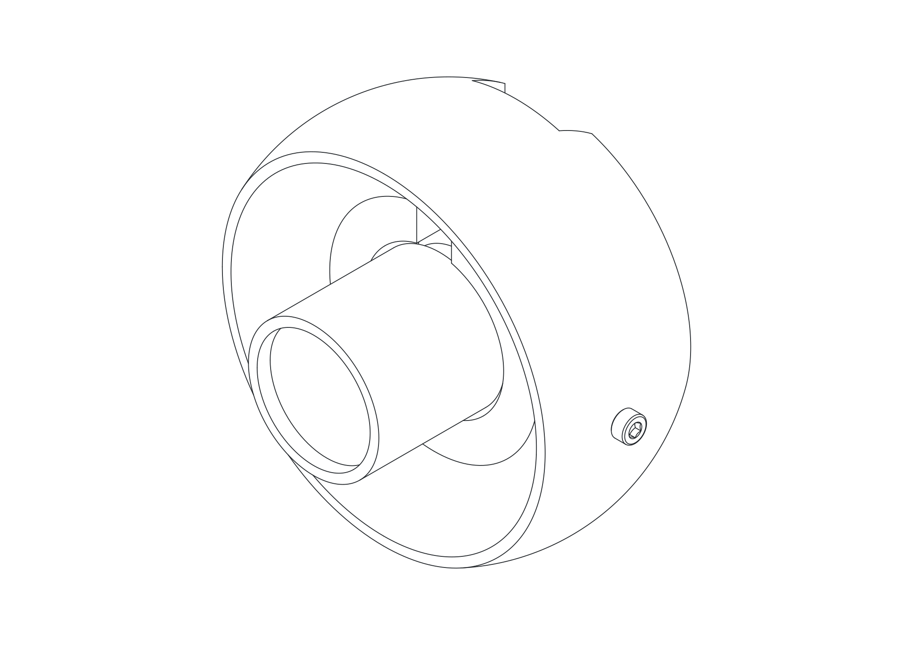
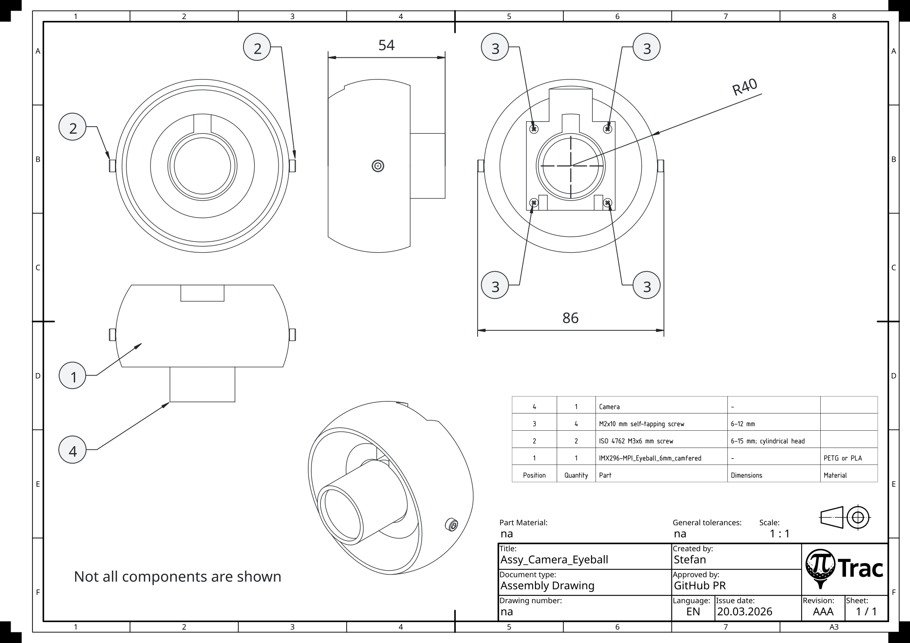
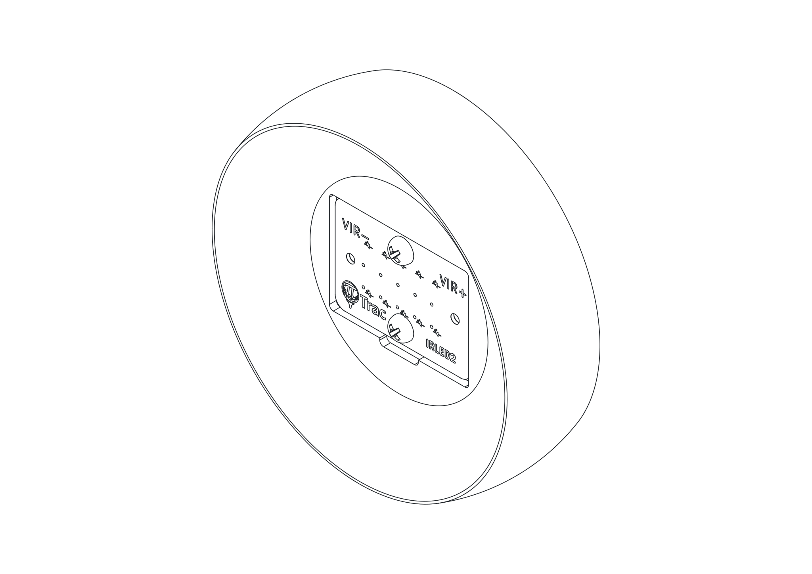
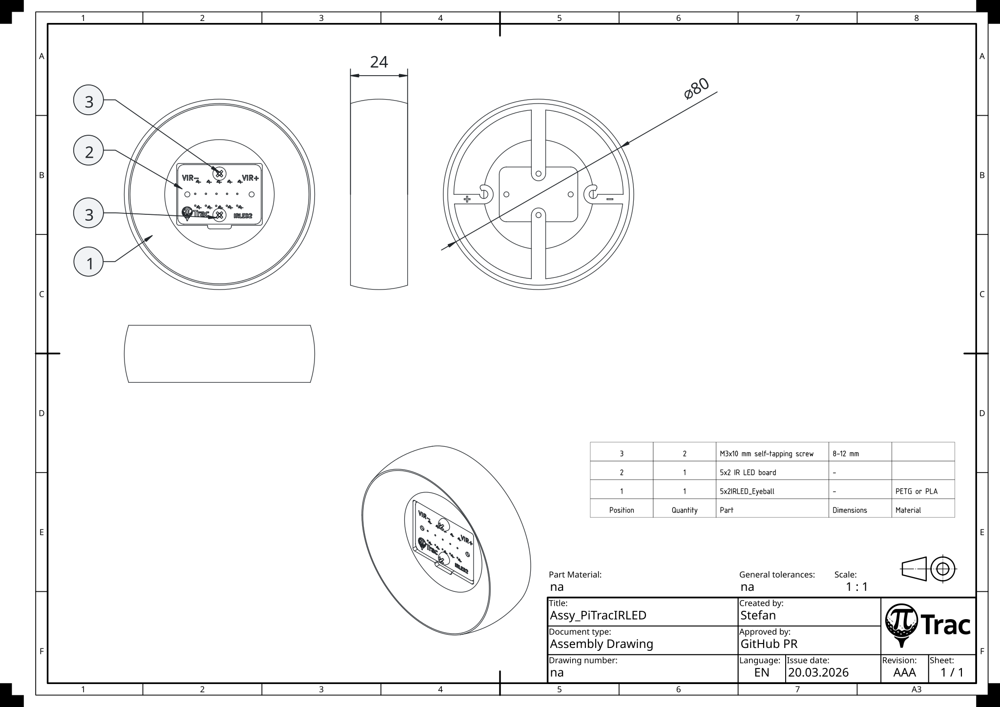
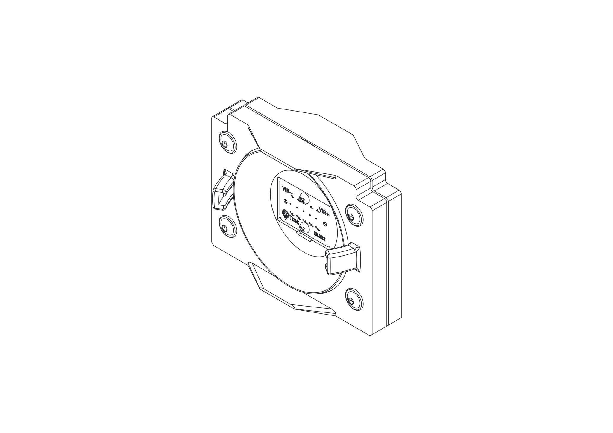
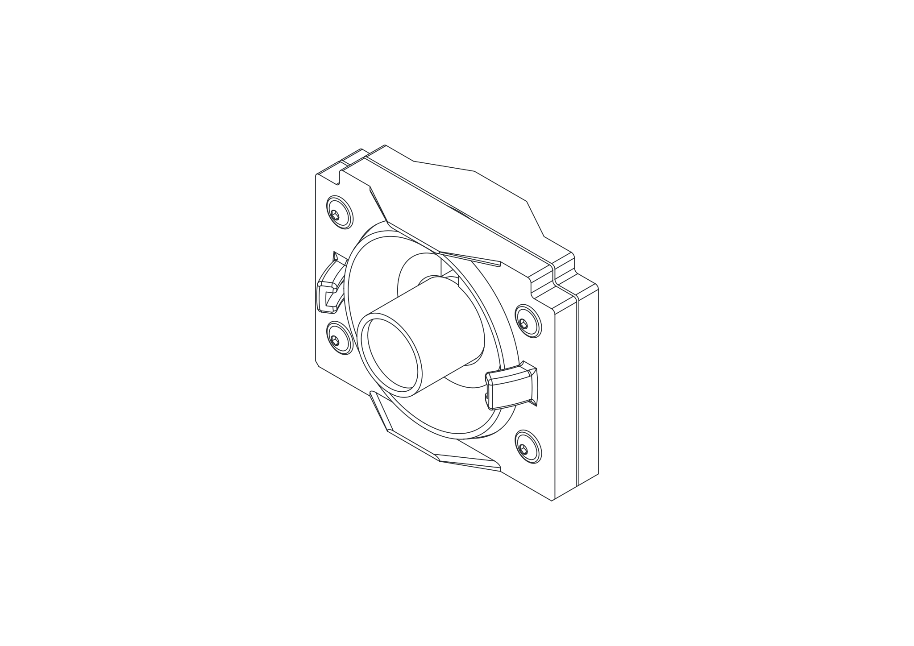
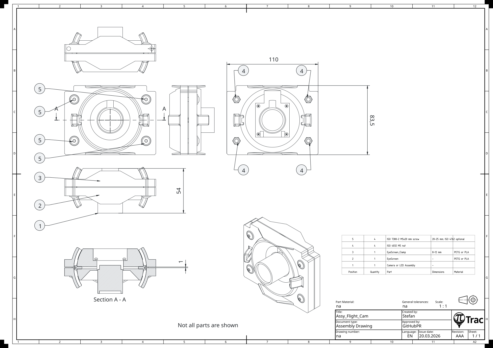

# Eyeball Sub-Assemblies

These are the four bench-built parts that fit inside the eyeball housings. Build the Camera Assembly and either LED Assembly first, then wrap each in an Eyeball Assembly.

---

## Camera Assembly

=== "3D"

    { .assembly-diagram }

=== "Drawing"

    { .assembly-diagram }

Tools:

- Cross-head screwdriver
- 2.5 mm Allen key
- Sandpaper (optional)

| Part | Qty | Notes |
|------|-----|-------|
| [IMX296-MPI_Eyeball_6mm_camfered.stl](https://github.com/PiTracLM/PiTrac/raw/main/3D%20Printed%20Parts/Enclosure%20Version%203/Part/Print/IMX296-MPI_Eyeball_6mm_camfered.stl){ .stl-download } | 1 | Remove support material |
| ISO 4762 M3x6 mm screw | 2 | 6-15 mm; cylindrical head |
| M2x10 mm self-tapping screw | 4 | 6-12 mm |
| Camera | 1 | |

1. Remove all support material.
2. Smooth spherical surfaces if needed.
3. Chamfer or prime the two horizontal holes for **M3x6 mm** using a cross-head screwdriver.
4. Install both **M3x6 mm** screws with the Allen key. Ensure straight alignment.
5. Slightly loosen the aperture and focus screws on the **camera**. Align them with the slot. The ribbon cable connector must align with the opening.
6. Attach the camera to the **eyeball** using four **M2x10 mm self-tapping screws**.

!!! note
    Choose the appropriate eyeball for your camera and lens. See [Variants](../3d-printing.md#variants) on the 3D Printing page for the alternate eyeball STLs (2.8 mm or 6 mm, camfered or plain).

---

## LED Assembly (5x2 IR LED board)

=== "3D"

    { .assembly-diagram }

=== "Drawing"

    { .assembly-diagram }

Tools:

- Cross-head screwdriver

| Part | Qty | Notes |
|------|-----|-------|
| [5x2IRLED_Eyeball.stl](https://github.com/PiTracLM/PiTrac/raw/main/3D%20Printed%20Parts/Enclosure%20Version%203/Part/Print/5x2IRLED_Eyeball.stl){ .stl-download } | 1 | |
| 5x2 IR LED board | 1 | |
| M3x10 mm self-tapping screw | 2 | 8-12 mm |

1. Remove all support material.
2. Smooth spherical surfaces if needed.
3. Insert the already wired **5x2 IR LED board** in the **5x2IRLED_Eyeball**. Match electric polarity.
4. Install the four **M3x10 mm self-tapping screws**. Do not overtighten.
5. Clip the cables in place and ensure correct polarity. Keep the cables as far apart as possible.

---

## LED Assembly (Legacy COB)

Tools:

- Cross-head screwdriver

| Part | Qty | Notes |
|------|-----|-------|
| [LED_Eyeball.stl](https://github.com/PiTracLM/PiTrac/raw/main/3D%20Printed%20Parts/Enclosure%20Version%203/Part/Print/Legacy/LED_Eyeball.stl){ .stl-download } | 1 | |
| [LED_Clamp.stl](https://github.com/PiTracLM/PiTrac/raw/main/3D%20Printed%20Parts/Enclosure%20Version%203/Part/Print/Legacy/LED_Clamp.stl){ .stl-download } | 1 | |
| 100 W COB IR LED with wires | 1 | |
| 60 deg LED Lens (44 mm + Reflector) | 1 | |
| M3x10 mm self-tapping screw | 4 | 8-12 mm |

1. Remove all support material.
2. Smooth spherical surfaces if needed.
3. Insert the **reflector** in the **LED_Eyeball**.
4. Insert the **COB LED** in the **reflector**.
5. Position the **LED_Clamp** on the **COB LED**. Ensure that the centering pins of the **LED_Clamp** are engaged with the **COB LED** holes. Ensure that the LED cables are not squished.
6. Install the four **M3x10 mm self-tapping screws**. Do not overtighten. The clamp is designed with clearance, so that the LED is always preloaded.

---

## Eyeball Assembly

=== "Tee Cam"

    { .assembly-diagram }

=== "LED Screen"

    { .assembly-diagram }

=== "Flight Cam (3D)"

    { .assembly-diagram }

=== "Flight Cam (Drawing)"

    { .assembly-diagram }

Tools:

- 3 mm Allen key for ISO 7380-2 or 4 mm for ISO 4762
- Sandpaper (optional)
- Superglue (optional)

| Part | Qty | Notes |
|------|-----|-------|
| Camera Assembly or LED Assembly | 1 | |
| [EyeScreen.stl](https://github.com/PiTracLM/PiTrac/raw/main/3D%20Printed%20Parts/Enclosure%20Version%203/Part/Print/EyeScreen.stl){ .stl-download } | 1 | |
| [EyeScreen_Clamp.stl](https://github.com/PiTracLM/PiTrac/raw/main/3D%20Printed%20Parts/Enclosure%20Version%203/Part/Print/EyeScreen_Clamp.stl){ .stl-download } | 1 | |
| ISO 4032 M5 nut | 4 | |
| ISO 7380-2 M5x20 mm screw | 4 | 20-25 mm; ISO 4762 optional |

1. Remove support material.
2. Smooth spherical surfaces if needed.
3. Insert **M5 nuts** into the **EyeScreen_Clamp** pockets (optional: secure with superglue).
4. Insert the **Camera Assembly** or **LED Assembly** into the **EyeScreen**.
5. Ensure correct orientation: notches must face upwards (toward the ribbon cable).
6. Install the **M5 screws** and tighten only lightly.

!!! note
    ISO 7380-2 button-head screws look nicer and provide more surface contact. ISO 4762 offers better tool access.
