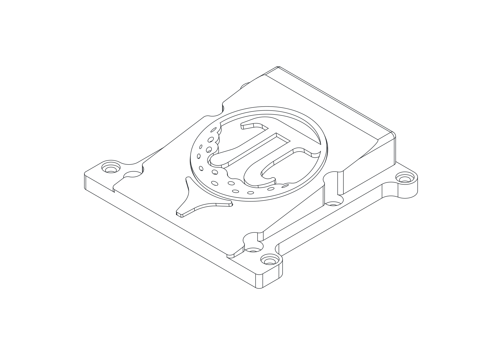
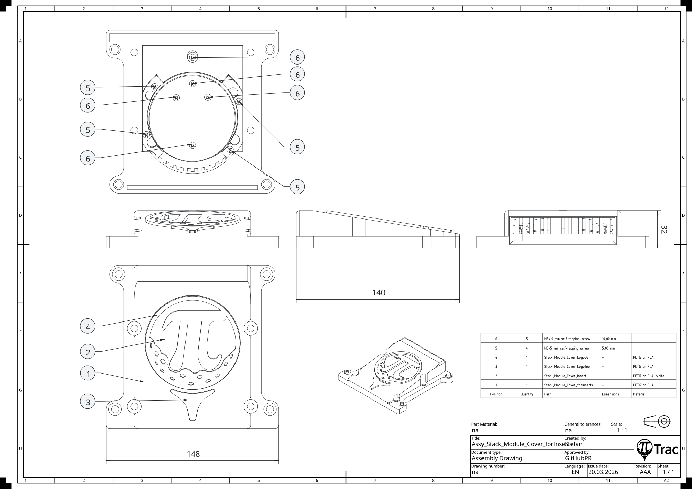
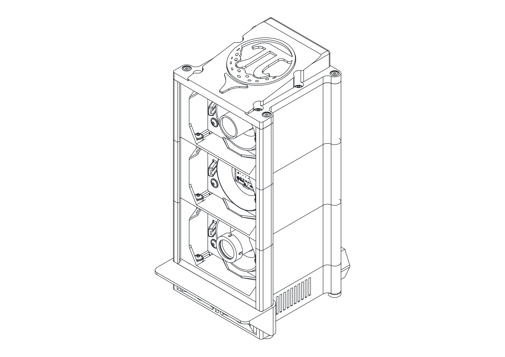

# Final Assembly

Bring the sub-assemblies and modules together. This phase covers cover assembly, stacking the modules in sequence, wiring the electronics, installing the cover, and adding the feet.

---

## Cover Assembly

=== "3D"

    { .assembly-diagram }

=== "Drawing"

    { .assembly-diagram }

Tools:

- Cross-head screwdriver

| Part | Qty | Notes |
|------|-----|-------|
| [Stack_Module_Cover_forInserts.stl](https://github.com/PiTracLM/PiTrac/raw/main/3D%20Printed%20Parts/Enclosure%20Version%203/Part/Print/Stack_Module_Cover_forInserts.stl){ .stl-download } | 1 | |
| [Stack_Module_Cover_insert.stl](https://github.com/PiTracLM/PiTrac/raw/main/3D%20Printed%20Parts/Enclosure%20Version%203/Part/Print/Stack_Module_Cover_insert.stl){ .stl-download } | 1 | |
| [Stack_Module_Cover_LogoTee.stl](https://github.com/PiTracLM/PiTrac/raw/main/3D%20Printed%20Parts/Enclosure%20Version%203/Part/Print/Stack_Module_Cover_LogoTee.stl){ .stl-download } | 1 | |
| [Stack_Module_Cover_LogoBall.stl](https://github.com/PiTracLM/PiTrac/raw/main/3D%20Printed%20Parts/Enclosure%20Version%203/Part/Print/Stack_Module_Cover_LogoBall.stl){ .stl-download } | 1 | |
| M3x5 mm self-tapping screw | 4 | |
| M3x10 mm self-tapping screw | 5 | |

1. Place and twist the **Stack_Module_Cover_insert** into the **Stack_Module_Cover_forInserts**. Ensure correct orientation.
2. Push the **Stack_Module_Cover_LogoTee** in the **Stack_Module_Cover_forInserts**. Secure with one **M3x10 mm self-tapping screw** from below.
3. Push the **Stack_Module_Cover_LogoBall** in the **Stack_Module_Cover_insert**. Secure with four **M3x10 mm self-tapping screws** from below.
4. Ensure the logo sits flush and is not rotated. Clamp down the **Stack_Module_Cover_insert** slightly with four **M3x5 mm self-tapping screws** from below.

!!! note
    There are alternative **Stack_Module_Cover** variants available, providing a less complex and less material-intensive print.

---

## Stack Module to Stack Module Assembly

=== "3D"

    { .assembly-diagram }

=== "Drawing"

    { .assembly-diagram }

Tools:

- 3 mm or 4 mm Allen key (ball-end preferred)

| Part | Qty | Notes |
|------|-----|-------|
| Camera Stack Module Assembly | 2 | |
| LED Stack Module Assembly | 1 | |
| PSU Stack Module Assembly | 1 | |
| ISO 7380-2 M5x15 mm screw | 8 | 10-15 mm; ISO 4762 optional |
| ISO 7380-2 M5x10 mm screw | 4 | 10 mm; ISO 4762 optional |

**2nd on 1st stack**

1. Pre-tap the upper **Stack_Module** holes.
2. Mount the **Camera Stack Module Assembly** with 4x M5x10 mm screws.

!!! warning
    Use 10 mm screws only to ensure clearance above the **PSU**.

**3rd on 2nd stack**

1. Pre-tap the upper **Stack_Module** holes.
2. Mount the **LED Stack Module Assembly** with 4x M5x15 mm screws.

**4th on 3rd stack**

1. Pre-tap the upper **Stack_Module** holes.
2. Mount the **Camera Stack Module Assembly** with 4x M5x15 mm screws.

---

## Electronics Installation

{ .assembly-diagram }

Tools:

- (none)

| Part | Qty | Notes |
|------|-----|-------|
| Pi 5 Assembly | 1 | choose height and hole version according to your setup (NVMe, HDMI access, etc.) |
| ConnectorBoardv3 Assembly | 1 | |
| [Carrier_Clamps.stl](https://github.com/PiTracLM/PiTrac/raw/main/3D%20Printed%20Parts/Enclosure%20Version%203/Part/Print/Carrier_Clamps.stl){ .stl-download } | 4 | |

1. Slide the **ConnectorBoardv3 assembly** in the inner-most slot and attach the power supply wires. Input terminals should face downwards toward the power supply.
2. Plug in the USB cable from the LED strip and the USB-C cable for the Raspberry Pi.
3. Connect the LED wires to the connector board terminals. Clip the cables in the **ConnectorBoardv3_Carrier** to ensure maximal distance between + and - wires.
4. Install the dupont-connector wires for the connector board. Refer to the wiring diagram above for the V3 Connector Board to Pi 5 pinout.
5. Pinch the carrier clamps with two fingers and place them below and above the **ConnectorBoardv3 assembly** to fix its position. The board should sit between the first and second stack.
6. Slide in the **Pi 5 assembly** in the inner-most slot. Optional: it can be positioned in the small pocket behind the inner-most slot for a static, non-movable position.
7. Connect the USB-C power supply, both camera ribbon cables, and the dupont-connector wires from the connector board and flight cam to the Pi 5.
8. Pinch the carrier clamps with two fingers and place them below and above the **Pi 5 assembly** to fix its position. The board should sit in the upper-most stack.
9. Visually inspect the wiring. All cables in the right terminals? Nothing pinched or squeezed? Sufficient spacing between the LED cables?

!!! note
    There are alternative **Pi 5** mounts available. This version is for wireless Pi access only. If you need regular wired access, print and use `Enclosure Version 3/Part/Print/Variants/Pi5_Bagpack`, `_top`, and `_bottom`. This will require additional cuts to the Acrylic backplate.

!!! note
    This assembly state is a good point to fire up the PiTrac for the first time, since all parts are easily accessible.

---

## Cover Installation

Tools:

- 3 mm Allen key for ISO 7380-2 or 4 mm for ISO 4762
- Saw for trimming the M5 rods
- File for deburring

| Part | Qty | Notes |
|------|-----|-------|
| Stack_Module_Cover_forInserts assembly | 1 | |
| M5 x 12 mm sleeve nut | 4 | |
| ISO 4032 M5 nut | 4 | alternative to sleeve nuts |
| ISO 10511 M5 lock nut | 4 | lock preferred, ISO 4032 will work as well |
| M5x306 mm rod | 4 | trim to 306 mm, or longer (318 mm) for normal nuts |
| [Spacer.stl](https://github.com/PiTracLM/PiTrac/raw/main/3D%20Printed%20Parts/Enclosure%20Version%203/Part/Print/Spacer.stl){ .stl-download } | 4 | |
| M5 washer | 4 | alternative to sleeve nuts |
| ISO 7380-2 M5x15 mm screw | 4 | 10-15 mm; ISO 4762 optional |
| Acrylic Shankshield | 1 | |
| Acrylic Backplate | 1 | |

**Stack_Module_Cover on 4th stack**

1. Pre-tap the upper **Stack_Module** holes.
2. Insert four spacers into the **Camera Stack Module Assembly** (for alignment).
3. Mount the **Stack_Module_Cover** with **4x M5x15 mm screws**.
4. Slide in the **Acrylic Shankshield** and **Acrylic Backplate**.
5. Cut **rods** to 306 mm and deburr. (318 mm optional)
6. Thread **ISO 10511 M5 lock nuts** onto the **rods** and insert them from below into the **PSU Stack Module** (nuts must seat in the hex pockets).
7. Ensure the rods stand out about 2 mm at the bottom of the **PSU Stack Module**.
8. Install **sleeve nuts** on the top end at the **Stack_Module_Cover**, or install washers and nuts on the top end at the **Stack_Module_Cover**.

!!! note
    Sleeve nuts on the cover are more aesthetic and require shorter rods.

!!! note
    Alternative to the M5 rods, four ISO 4762 M5x35 mm screws can be used in the Stack_Module_PSU. This is more suited to a prototype setup where regular disassembly is expected.

---

## Feet

Tools:

- Superglue

| Part | Qty | Notes |
|------|-----|-------|
| [Foot.stl](https://github.com/PiTracLM/PiTrac/raw/main/3D%20Printed%20Parts/Enclosure%20Version%203/Part/Print/Foot.stl){ .stl-download } | 4 | |
| ISO 4032 M5 nut | 4 | |

1. Glue the nuts into the **feet**.
2. Wait for the glue to be fully cured.
3. Thread the **feet** onto the M5 rods of the full assembly. Turn them all the way up and adjust as needed.
