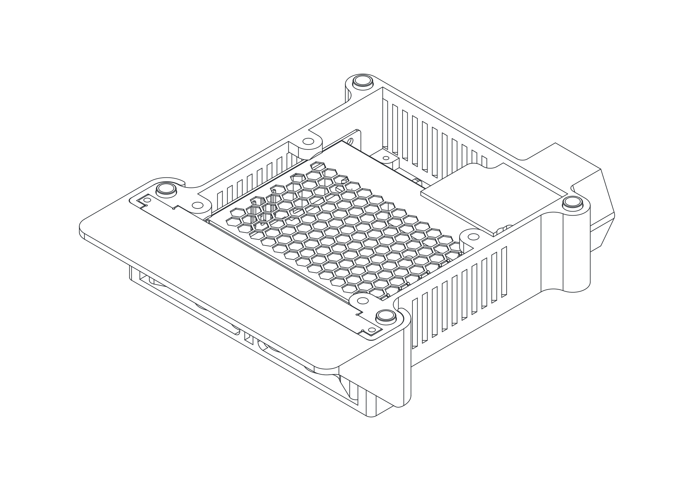
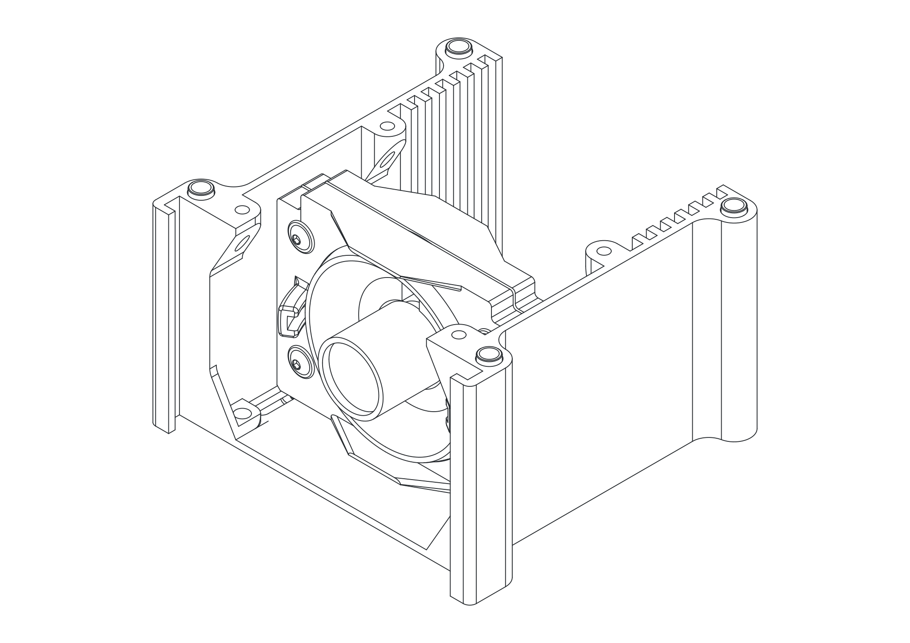
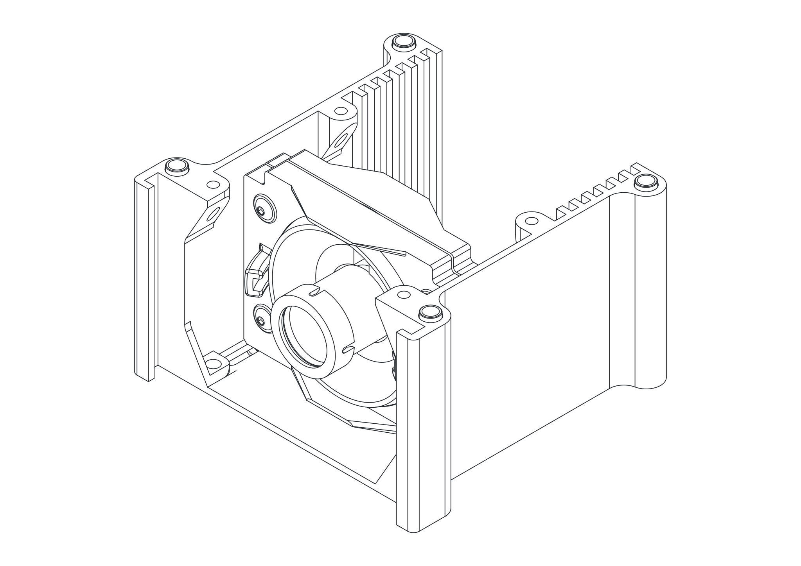
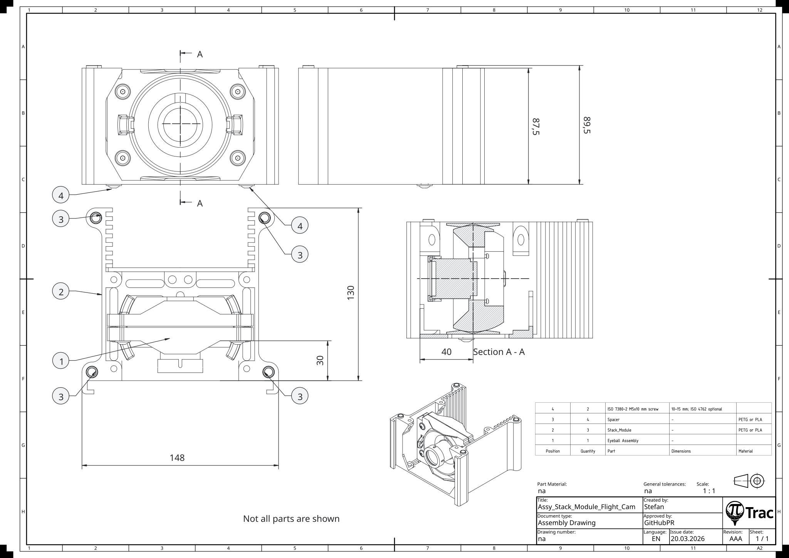
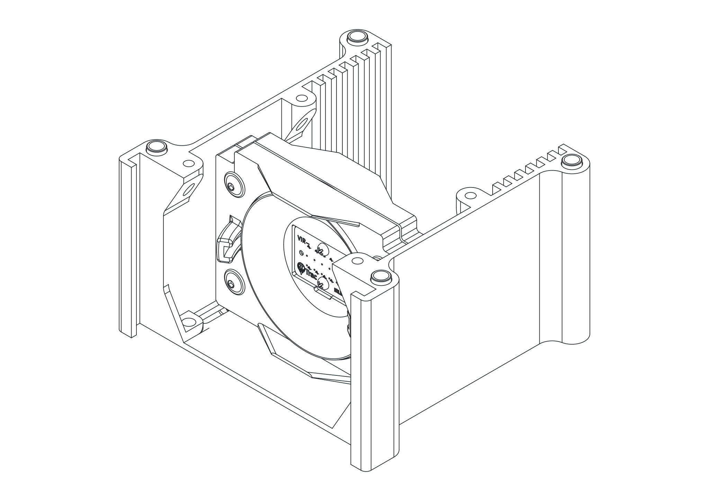

# Stack Modules

A stack module is the structural building block of the V3 enclosure. Each module is a printed frame with electronics or eyeballs mounted inside. The modules bolt together in sequence to form the finished tower.

Build the modules in this order: PSU first (the base of the stack), then the two Camera modules, then the LED module.

---

## PSU Stack Module

=== "3D"

    { .assembly-diagram }

=== "Drawing"

    { .assembly-diagram }

Tools:

- Cross-head screwdriver
- 3 mm Allen key for ISO 7380-2 or 4 mm for ISO 4762

| Part | Qty | Notes |
|------|-----|-------|
| [Stack_Module_PSU_vent.stl](https://github.com/PiTracLM/PiTrac/raw/main/3D%20Printed%20Parts/Enclosure%20Version%203/Part/Print/Stack_Module_PSU_vent.stl){ .stl-download } | 1 | |
| [Ambient_LED_Screen.stl](https://github.com/PiTracLM/PiTrac/raw/main/3D%20Printed%20Parts/Enclosure%20Version%203/Part/Print/Ambient_LED_Screen.stl){ .stl-download } | 1 | |
| [LinePower_Cover.stl](https://github.com/PiTracLM/PiTrac/raw/main/3D%20Printed%20Parts/Enclosure%20Version%203/Part/Print/LinePower_Cover.stl){ .stl-download } | 1 | |
| [Ambient_LED_Visor.stl](https://github.com/PiTracLM/PiTrac/raw/main/3D%20Printed%20Parts/Enclosure%20Version%203/Part/Print/Ambient_LED_Visor.stl){ .stl-download } | 1 | |
| [Spacer.stl](https://github.com/PiTracLM/PiTrac/raw/main/3D%20Printed%20Parts/Enclosure%20Version%203/Part/Print/Spacer.stl){ .stl-download } | 4 | |
| Meanwell LRS-75-5 | 1 | |
| AC Power Inlet C14 with Fuse | 1 | |
| USB COB LED Strip Lights 6.56 ft | 1 | roughly 60 cm required; 8 mm width |
| Wires | 3 | |
| M3x6 mm screw | 2 | 5-6 mm |
| M3x5 mm self-tapping screw | 4 | 5-6 mm |
| M3x10 mm self-tapping screw | 4 | 5-16 mm |
| ISO 4762 M5x35 mm screw | 4 | optional, alternative to the M5 through rod design |
| ISO 10511 M5 lock nut | 4 | optional, alternative to the M5 through rod design; lock preferred, ISO 4032 will work as well |

1. Remove support material.
2. Mount the **Meanwell PSU** in the **Stack_Module_PSU_vent** with two **M3x6 mm screws** from the bottom side (in the center of the PSU).
3. Add two **M3x5 mm self-tapping screws** from the top side (in the corners of the PSU). 6 mm screws will also work, but will cause a slight bump in the bottom side surface.
4. Install the three **wires** on the screw terminals of the PSU. Use the standard color code for PE, L, N (US: G, N, H).
5. Install the **AC Power Inlet** in the **Stack_Module_PSU_vent** and plug in the wires on the right terminals. Fix the **AC Power Inlet** with two **M3x10 mm self-tapping screws**.
6. Get familiar with the right orientation of the **Ambient_LED_Screen** in the **Stack_Module_PSU_vent**.
7. Wrap the **USB COB LED Strip** on the **Ambient_LED_Screen**. Start in the lower left corner with roughly 2 cm after the USB cable. Stick the COB on the surface going horizontally rightwards. Wrap it around the corner. Go diagonally upwards so you meet the first wrap on the left side. Trim the strip roughly 2 cm after the last front face wrap. The result should be four horizontal strips in the front and three diagonal ones in the back.
8. Install the wrapped **Ambient_LED_Screen** in the **Stack_Module_PSU_vent**. First thread the USB cable through the left gap between housing and PSU. Stick the screen in the slot and secure it with two **M3x10 mm self-tapping screws**.
9. Double check correct wiring and install the **LinePower_Cover** with two **M3x5 mm self-tapping screws**.
10. Slide or clip on the **Ambient_LED_Visor**.
11. Place **spacers** in the four outermost holes on top.

!!! note
    This stack module is specifically designed for the Meanwell LRS-75-5. A different PSU is not recommended.

!!! note
    Four ISO 4762 M5x35 mm screws can be used in the Stack_Module_PSU if you do not want to opt for the through-rod variant. Insert four ISO 10511 M5 lock nuts in the base and install the four ISO 4762 M5x35 mm screws from the top.

---

## Camera Stack Module

=== "Tee Cam"

    { .assembly-diagram }

=== "Flight Cam (3D)"

    { .assembly-diagram }

=== "Flight Cam (Drawing)"

    { .assembly-diagram }

Tools:

- 3 mm Allen key for ISO 7380-2 or 4 mm for ISO 4762

| Part | Qty | Notes |
|------|-----|-------|
| Camera Screen Assembly | 1 | |
| [Stack_Module.stl](https://github.com/PiTracLM/PiTrac/raw/main/3D%20Printed%20Parts/Enclosure%20Version%203/Part/Print/Stack_Module.stl){ .stl-download } | 1 | |
| [Spacer.stl](https://github.com/PiTracLM/PiTrac/raw/main/3D%20Printed%20Parts/Enclosure%20Version%203/Part/Print/Spacer.stl){ .stl-download } | 4 | |
| Filter holder | 1 | flight cam only. Pick one. [IRFilter_Mount_1inchround.stl](https://github.com/PiTracLM/PiTrac/raw/main/3D%20Printed%20Parts/Enclosure%20Version%203/Part/Print/Variants/IRFilter_Mount_1inchround.stl){ .stl-download } for a **round** 1" filter, or [Pi Cam Filter Holder.stl](https://github.com/PiTracLM/PiTrac/raw/main/3D%20Printed%20Parts/Enclosure%20Version%202/Pi-Camera-Light-Filter-Holder/Pi%20Cam%20Filter%20Holder.stl){ .stl-download } (V2 carry-over) for a **square** 1" filter on the standard 6mm M12 lens. For other lens focal lengths or non-standard filter thicknesses, use the parameterized [Pi Cam Filter Holder - M12 Lens.stl](https://github.com/PiTracLM/PiTrac/raw/main/3D%20Printed%20Parts/Enclosure%20Version%202/Pi-Camera-Light-Filter-Holder%20-%20M12/Pi%20Cam%20Filter%20Holder%20-%20M12%20Lens.stl){ .stl-download } with the FreeCAD source. |
| ISO 7380-2 M5x10 mm screw | 2 | 10-15 mm; ISO 4762 optional |
| IR-Pass Filter | 1 | 1" round or 1" square, flight cam only |

1. Remove support material.
2. Pre-tap the lower **EyeScreen** holes with a screw.
3. Mount the **Camera Screen Assembly** to the **Stack_Module**. Recommended front-plane distance: 30 mm (same left and right).
4. Place **spacers** in the four outermost holes on top.
5. Only for the flight camera: place the **IR-Pass Filter** onto the lens and clip the matching filter holder on the lens (round or square, depending on filter shape). Process may vary.

!!! warning "Run distortion calibration before installing the filter"
    The [distortion calibration](../../cameras/distortion-correction.md) step uses a printed ChArUco board illuminated by visible light. The IR-pass filter blocks visible light and will prevent the detector from finding the pattern.

    Either defer installing this filter until after you have completed distortion calibration on Camera 2, or plan to temporarily remove it later when you calibrate.

---

## LED Stack Module

{ .assembly-diagram }

Tools:

- 3 mm Allen key for ISO 7380-2 or 4 mm for ISO 4762

| Part | Qty | Notes |
|------|-----|-------|
| LED Screen Assembly | 1 | |
| [Stack_Module.stl](https://github.com/PiTracLM/PiTrac/raw/main/3D%20Printed%20Parts/Enclosure%20Version%203/Part/Print/Stack_Module.stl){ .stl-download } | 1 | |
| [Spacer.stl](https://github.com/PiTracLM/PiTrac/raw/main/3D%20Printed%20Parts/Enclosure%20Version%203/Part/Print/Spacer.stl){ .stl-download } | 4 | |
| ISO 7380-2 M5x10 mm screw | 2 | 10-15 mm; ISO 4762 optional |

1. Remove support material.
2. Pre-tap the lower **EyeScreen** holes with a screw.
3. Mount the **LED Screen Assembly** to the **Stack_Module**. Recommended front-plane distance: 30 mm (same left and right).
4. Place **spacers** in the four outermost holes on top.
