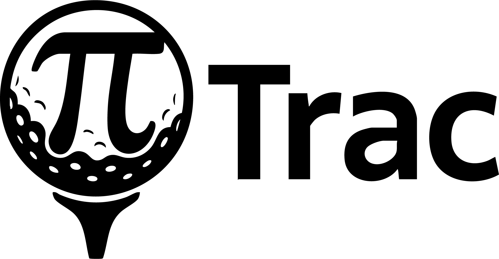
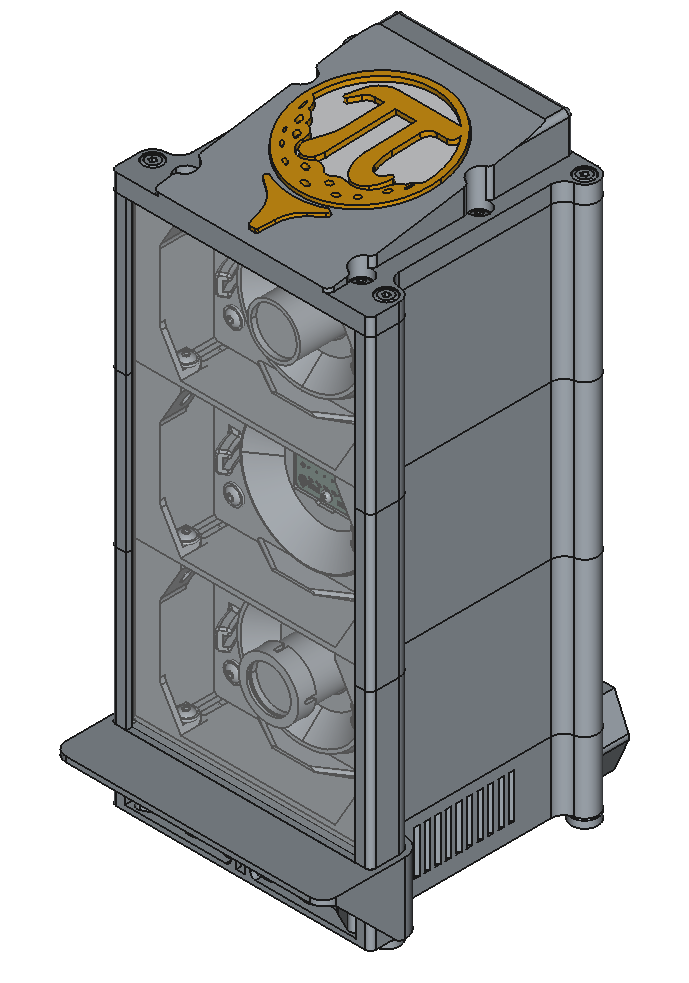

{ width="300" .pitrac-logo-hero }

# PiTrac - The World's First Open-Source Golf Launch Monitor

The PiTrac project is a fully-functional golf launch monitor that avoids the need for expensive high-shutter-speed and high frame-rate cameras. We've developed techniques for high-speed, infrared, strobe-based image capture and processing using low-cost cameras such as the Pi Global Shutter camera (~US$50 retail) and Raspberry Pi single board computers.

-   :material-hammer-wrench:{ .lg .middle } __Build Guide__

    ---

    Start here — complete guide from parts to first shot.

    [:octicons-arrow-right-24: Get started](build-guide/index.md)

-   :material-chip:{ .lg .middle } __Hardware__

    ---

    Parts list, PCB assembly, V3 enclosure, and cameras.

    [:octicons-arrow-right-24: Hardware docs](hardware/index.md)

-   :material-code-braces:{ .lg .middle } __Software__

    ---

    Raspberry Pi setup, installation, and configuration.

    [:octicons-arrow-right-24: Software docs](software/index.md)

-   :material-book-open-variant:{ .lg .middle } __Reference__

    ---

    Troubleshooting, glossary, and known issues.

    [:octicons-arrow-right-24: Reference](reference/index.md)

## What Does PiTrac Do?

PiTrac determines golf ball launch speed, angles, and spin in 3 axes. Its output is accessible on a stand-alone web-based app, and interfaces to popular golf-course simulators including **GsPro** and **E6/TruGolf** are working.

{ width="400" }

## Is PiTrac For You?

PiTrac is **not a commercial product** for sale -- the full design is being released as open source on GitHub for folks to build themselves. The Raspberry Pi 5 (8GB) is the most expensive part at around **US$134.50**, with the two Pi cameras adding to the total. PiTrac uses off-the-shelf hardware with a [parts list](hardware/parts-list.md) including supplier links. The only custom part is a small printed circuit board that can be manufactured for a few dollars.

**It's not easy**, but if you're handy with a soldering iron, can figure out how to 3D print the parts, and are willing to burrow into the Linux operating system to compile and install software, you should be able to create your own PiTrac!

## Community & Resources

We are hoping to inspire a community of developers to help test and continue PiTrac's development. This is still a young project -- the basic features usually work reliably, but the current release needs polish. We're looking for folks to build their own PiTracs and help us improve the documentation and design.

- **[Hackaday Project Page](https://hackaday.io/project/195042-pitrac-the-diy-golf-launch-monitor)** - Project details and development logs
- **[Reddit Community](https://www.reddit.com/r/Golfsimulator/comments/1hnwhx0/introducing_pitrac_the_open_source_launch_monitor/)** - Discussion and support
- **[YouTube Channel](https://www.youtube.com/@PiTrac)** - Videos and tutorials
- **[GitHub Repository](https://github.com/PiTracLM/PiTrac)** - Source code, 3D models, and hardware designs
- **[Support PiTrac](https://ko-fi.com/Pitrac)** - Help fund continued development
- **[Project Wish List](https://www.amazon.com/registries/gl/guest-view/11PSDIVICY8UX)** - Equipment needs

<figure markdown="span">
  <iframe width="640" height="420" src="https://www.youtube.com/embed/1pX95VoKsS4?si=O_Mzlwz3F93mBZXC" frameborder="0" allowfullscreen></iframe>
  <figcaption>Introduction to PiTrac's Enclosure</figcaption>
</figure>

!!! info "For Contributors"
    Interested in contributing to PiTrac development? Check out the [Developer Guide](developer/index.md) for architecture docs, build system details, and contribution guidelines.

---

*Raspberry Pi is a trademark of Raspberry Pi Ltd. The PiTrac project is not endorsed, sponsored by or associated with Raspberry Pi or Raspberry Pi products or services.*
