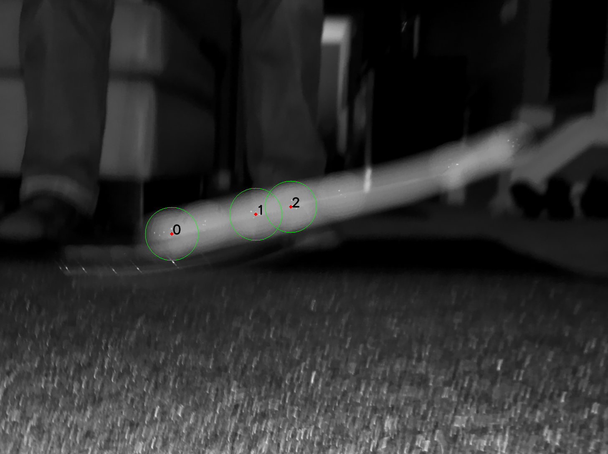
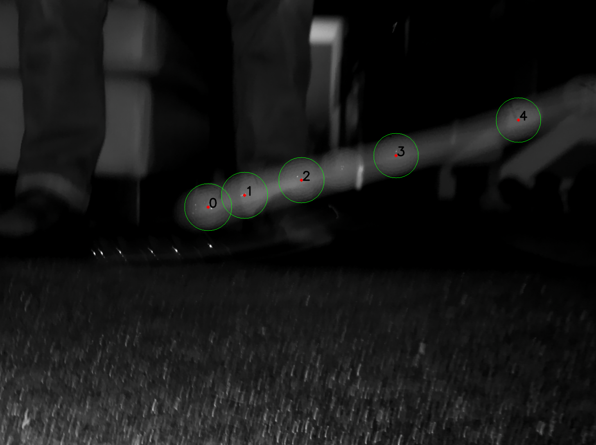
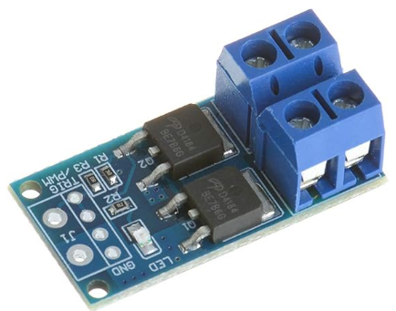
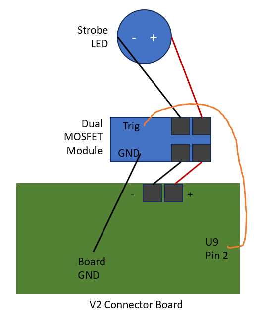
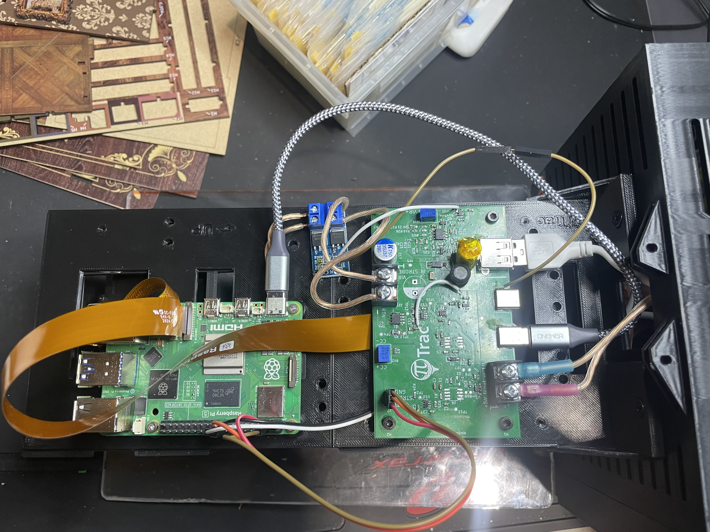
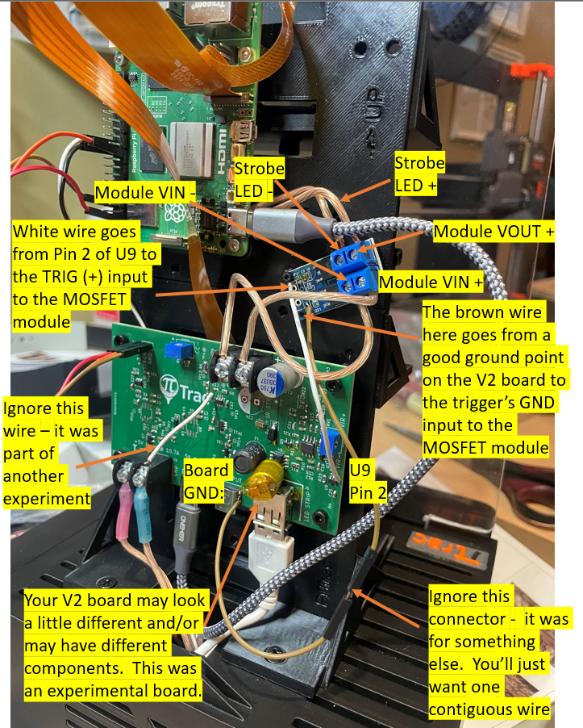
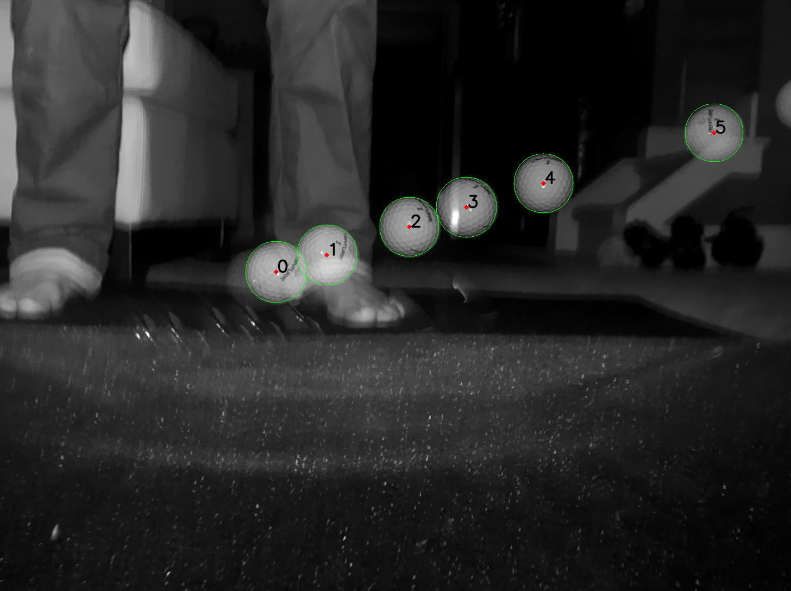
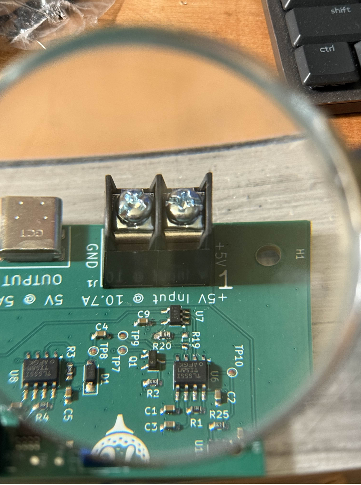
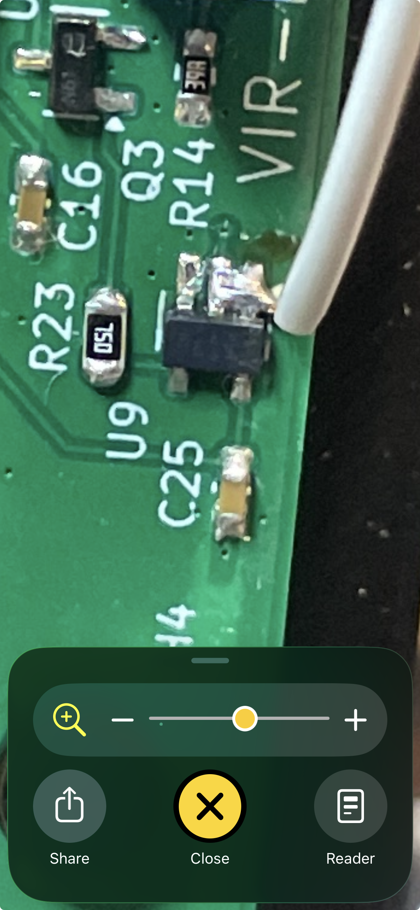
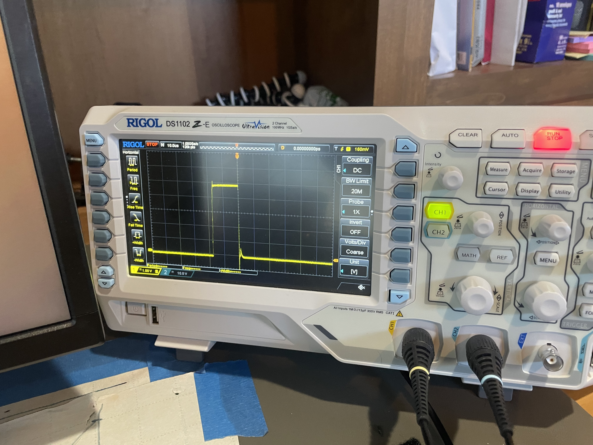

# Modifying the V2 Connector Board to Fix the Strobe Not Shutting Off

!!! note "Legacy board"
    This page applies only to the original V2 Connector Board. New builds use the [V3 Connector Board](../hardware/pcb-assembly.md), which has a different design that does not have this issue. If you have a V2 board, it still works; this modification lets you keep using it.

This document describes how to modify the original V2 Connector Board to fix a problem with the strobe not shutting off fully and/or quickly. It's pretty hack-y, and involves a bit of small hand-soldering. But, it does seem to work pretty well and is relatively inexpensive.

In order for the V2 board to work correctly, there is also a second modification that will be included in this document, even though the mod is not strictly related to the shut-off problem. This second mod involves moving the resistor that is currently in the "R19" position to the previously-empty "R20" position.

## The Problem

The initial version of the V2 Connector Board had an issue where the strobe light would not turn off completely or quickly enough after each pulse. This could lead to unwanted light exposure between pulses, which in turn created smearing and poor focus/sharpness of the individual ball images. This problem would then degrade the accuracy of the launch monitor, especially in regard to spin analysis.

A typical ball-exposure identification image when this problem happens looks like this:

Note that there is a completely different potential problem that looks very similar. This unrelated problem is caused by a missing or ineffective visible-light-cut filter on the ball-flight camera (cam 2). That sort of problem will also create some smear, but in this case the smear is much less pronounced, and is actually caused by visible light, not the IR light from the strobe. An example of this problem is shown here. This second problem is usually a lot easier to solve and will not be addressed here.

## Solution(s)

As a preface, the ultimate solution for this problem will probably be to retroactively modify the design of the V2 Connector Board itself, probably to include a MOSFET-based switching circuit for the strobe light. Also, the V3 Connector Board has a different design that should also take care of the issue.

However, in order to support folks who have the *current* V2 boards (because we're all about supporting our community!), a modification has been designed that adds a separate MOSFET module to the existing board. This module will provide better switching performance for the strobe light, ensuring it turns off fully and quickly after each pulse.

This solution uses the same module that was a component part of the V1 Connector Board. In some countries, Amazon has that module on sale for around US$1 a piece. For example, it is [available on Amazon](https://www.amazon.com/ANMBEST-High-Power-Adjustment-Electronic-Brightness/dp/B09KGDDS37/).

The solution described here essentially places a dual-MOSFET switching module in series with the existing strobe light output on the V2 Connector Board. The module is then triggered using a 5v signal that already exists on the V2 board. When the new inline module's input signal drops back to 0, the module will shutdown the pulse strobe very quickly, as the module is essentially a second switch in line with the strobe. When the module switches off, the power to the strobe will go off immediately even if the V2 board is still trying to push out some voltage.

The schematic for the modification is shown here:

The completed modification will look like this:

Finally, an annotated image of the completed modification is shown here to help identify the various connections:

When completed, the test V2 board that we modified produced this ball-exposure identification image. Note how the smear is gone and the ball images are now sharp and well-defined:

The modification steps further below will guide you through the process of making this change.

## Moving Resistor R19 to R20

Before detailing those steps for the MOSFET module, however, please note that it is also necessary to move the resistor from R19 to R20 on the board. The results of this mod are shown in the image below:

A few suggestions when moving the resistor:

1. Using a knife-edge solder tip can make it easier to apply heat simultaneously to both of the terminals of the resistor when removing it. Just remember to have a good pair of tweezers handy to make sure the resistor doesn't end up stuck to and baking on the solder tip.
2. When soldering the resistor into its new position, use some flux first to make sure the pads will accept the solder readily. It is often easier to flux just one pad, then apply a little blob of solder to that pad, and then use tweezers and the iron to get the resistor connected and positioned to just that first pad. After that is done, flux and solder the other end to the other pad.
3. If you lose or damage the resistor during its relocation, you may also be able to get things working by simply bridging a small piece of wire across the R20 terminal pads.

## Modification Steps for Fixing the Strobe Shutoff Problem

1. Attach trigger + and trigger ground wires to the MOSFET module:
    1. (This step is more easily done prior to mounting the MOSFET module onto your PiTrac.)
    2. Cut and strip the ends of two small gauge wires (e.g., 22-24 AWG), preferably one black and the other not red. Both should be long enough to easily reach where they will terminate on the Connector Board, around 15cm. Strip about 7mm of insulation off the ends that will be soldered to the module so you can push them into their respective holes. You'll want even less bare wire (5mm at the most) for the wire that will be soldered to Pin 2 of chip U9. That solder joint will be very small in a crowded area, so you don't want too much excess. You don't want to be trying to strip the second ends of these wires after the first ends have already been soldered to the module.
    3. Solder the black wire to the pad labeled "GND" on the MOSFET module (your labelling might be different).
    4. Solder the other wire to the pad labeled "TRIG" on the MOSFET module. This is the positive trigger input.
2. Prepare the wires to the strobe LED:
    1. Next, you'll need to modify the existing wiring from the V2 board to the strobe LED. See the schematic above. If you just had two wires from the -/+ posts on the V2 board that go straight to the LED, this will likely involve cutting those wires so that you end up with two short wires from the Connector Board and two longer wires to the Strobe.
    2. Consider marking the wires before you cut them to ensure you can keep track of which is + and which is -.
    3. NOTE: Try to keep the wire lengths here as short as possible. The drive circuit is very sensitive to wiring length, and longer wires can cause ringing, interference and other issues. Aim for less than 15cm total length if possible for each of the two paths.
    4. Strip 6-8mm of insulation off the four ends of the wires that will connect to the MOSFET module. Try to avoid too much bare wire.
3. Mount the MOSFET module:
    1. We found that the easiest way to mount the MOSFET module is to use an M2 melt-in insert and an M2 bolt through one or more corners of the module's PCB. The melt-in insert can be heated with a soldering iron and pressed into a small hole in the PiTrac tower, just above the Connector Board. Pre-drilling a hole for the insert will help ensure that the insert doesn't end up with melted plastic where the bolt was otherwise supposed to go (!). Make sure to position the module so that the wires you soldered in step 1 will easily reach their respective solder points on the V2 board.
    2. You could also try using (non-conducting) double-sided foam tape or hot glue to securely attach the MOSFET module to the V2 Connector Board, ensuring it is stable and won't move.
    3. Make sure the module is mounted in a way that avoids the USB-C cable that powers the Raspberry Pi and also allows easy access to the terminal blocks for wiring.
4. Connect the strobe LED wires and Connector Board Outputs to the MOSFET Module:
    1. You'll have to open up (unscrew) the little screws in the 4 terminal blocks on the MOSFET module to insert the wires. Tighten things down firmly, but remember the posts are not that robust.
    2. Double-check the wiring order here using the schematic above and the markings on the module and/or it's documentation.
    3. You want to ensure that the Connector Board's strobe + output goes to the MOSFET module's "IN +" terminal, and that the Board's - output goes to the module's "IN -" terminal. Same with the module outputs to the strobe.
5. Connect the Module's Trigger Wires to the Connector Board:
    1. This is probably the trickiest part of the modification, as the area around chip U9 is quite crowded and it's difficult soldering even a small wire to the tiny Pin on the chip.
    2. First, solder the ground wire from the MOSFET module to any convenient ground point on the V2 Connector Board. A good place may be to one of the ground Pins of the USB cable connectors, as they are relatively large and easy to access. Just make sure that the connector's metal shell is actually connected to ground, however!
    3. Next, solder the trigger wire from the MOSFET module to Pin 2 of chip U9 on the V2 Connector Board. This is the Pin that provides the 5v trigger signal for the strobe. You may need to use a magnifying glass or jeweler's loupe to see this area clearly.
    4. A trick here is to exploit the fact that Pin 1 is an unused Pin on the chip and is not electrically connected to anything (at least for the component we've been using). So, you can solder the trigger wire to both Pins 1 and 2 (with the wire coming in from the right (edge) side of the board.
    5. Use a little external solder flux on Pins 1 and 2 (making sure none of it gets near Pin 3) and heat it up a bit with your soldering iron before adding some solder at least Pin 2, but also maybe between Pins 1 and 2 to have more material to work with. Make sure you also put some flux on the trigger wire coming from the MOSFET module, and then heat up the blob on Pin 2 and insert the wire into the blob and then pull the iron out.
    6. Lower-temperature solder (e.g., leaded solder) may help here to avoid damaging the chip with too much heat and just to make it easier generally. HOWEVER, be very careful if you use leaded solder, as it's dangerously toxic and absolutely requires good ventilation and proper handling/disposal. Lead-free solder is safer, but harder to work with.
    7. Be very careful not to create any solder bridges to adjacent Pins on the chip.
    8. For those with an oscilloscope, you can verify that the trigger wire is transferring the proper 5v signal when the strobe is supposed to be firing. To do so, trigger on an upward edge and run the Pulse Test from the PiTrac UI.

Here is the soldering close up for the U9 chip:

You should see something like this if you look at the signal from the wire connected to U9 Pin 2:

