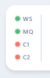
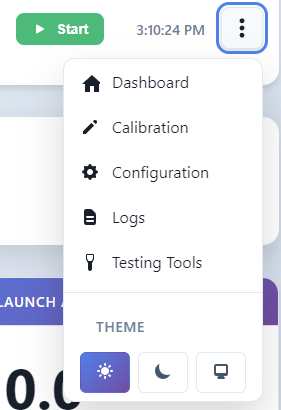
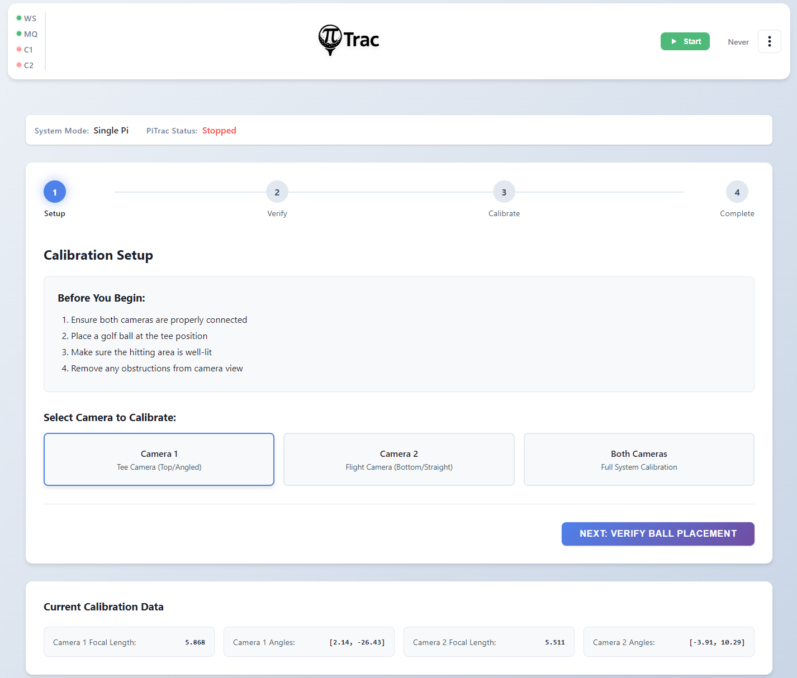
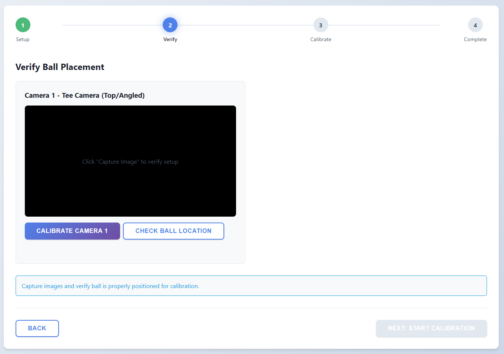

# Using PiTrac

So you've got PiTrac built and the software installed! Follow this guide to get going and start smacking some golf balls!!

## Web Interface

The PiTrac web interface can be reached from `{PI-IP}:8080`

If for some reason it's not found the first two things to check would be:

1. Is the PiTrac web service running?
    - You can verify with `systemctl status pitrac-web` and start it with `sudo systemctl start pitrac-web`
2. Are you visiting the right address?
    - You can verify the IP address on the pi with `ifconfig` and look for your configured interface with a local IP address
    - If you are using the desktop environment on the Pi - use `localhost` or `127.0.0.1` as the IP
    - Always use `http://`. We can look to support `https` in the future, but it adds a bit of complexity for the end user so for now we left it out.

### Header and Navigation

The header bar appears on every page and provides navigation, status monitoring, and PiTrac process control.

{ loading=lazy }

**Status indicators** (left side of header):

| Indicator | Label | Meaning |
|-----------|-------|---------|
| Green dot | **WS** | WebSocket connection to the server is active |
| Red dot | **WS** | WebSocket is disconnected (will auto-reconnect) |
| Green dot | **LM** | PiTrac launch monitor process is running (shows PID in tooltip) |
| Red dot | **LM** | PiTrac launch monitor is stopped |

These indicators poll the server every 5 seconds via `/health` and `/api/pitrac/status`.

**PiTrac controls** (desktop: visible in header; mobile: inside dropdown menu):

- **Start** -- calls `POST /api/pitrac/start` to launch the `pitrac_lm` binary
- **Stop** -- calls `POST /api/pitrac/stop` to send SIGTERM (then SIGKILL if needed)
- **Restart** -- stops then starts the process

When PiTrac is stopped, only the Start button is visible. When running, only Stop and Restart are shown.

!!! warning "Strobe Safety Gate"
    On V3 Connector Boards, Start and Restart check strobe safety first (`GET /api/strobe-safety`). If the V3 DAC is not calibrated, a modal dialog blocks the action and directs you to the Calibration page.

**Dropdown menu** (3-dot icon, top right):

{ loading=lazy }

The dropdown provides navigation to all pages and a theme selector:

- Dashboard (`/`)
- Calibration (`/calibration`)
- Configuration (`/config`)
- Logs (`/logs`)
- Testing Tools (`/testing`)
- Theme: Light / Dark / System (persisted to `localStorage`)

---

### Dashboard

{ loading=lazy }

The dashboard is the main page at `/`. It displays real-time shot data received via WebSocket.

#### Status Strip

The status strip spans the top of the dashboard and shows the current system state. It changes color and message based on the `result_type` field from the C++ process:

| State | Color | Message |
|-------|-------|---------|
| System Stopped | Red | PiTrac is not running |
| System Initializing | Pulse | Starting up PiTrac system... |
| Waiting for Ball | Blue | Please place ball on tee |
| Waiting for Simulator | Blue | Waiting for simulator to be ready |
| Ball Detected | Amber | Waiting for ball to stabilize... |
| Ready to Hit! | Green | Ball is ready, take your shot |
| Ball Hit! | Green | Processing shot data... |
| Multiple Balls Detected | Red | Please remove extra balls |
| Error | Red | An error occurred |

When a hit is detected, a **Reset** button appears on the status strip. Clicking it calls `POST /api/reset` to clear the shot data and image.

#### Metrics Panel

The left column shows shot metrics in a card layout:

- **Ball Speed** (hero card, large) -- displayed in mph
- **Launch Angle** -- degrees
- **Side Angle** -- degrees
- **Back Spin** -- rpm
- **Side Spin** -- rpm

Metrics animate briefly when updated. When PiTrac is not running, the metrics panel is dimmed (opacity 0.3).

#### Shot Image Panel

The right column displays the shot image. When a shot is captured, the C++ process sends an image notification via `POST /api/internal/image-ready`, and the dashboard displays the image. Click the image to open it full-size in a new tab.

When no image is available, the panel shows "Hit a shot to see the image here."

---

### Configuration

{ loading=lazy }

The Configuration page at `/config` is the central settings editor. No more editing 1000+ line JSON files!

#### First-Time Setup

When you first open Configuration, there are a few critical settings you need to set before anything will work:

##### Camera Hardware

**Camera 1 Type** and **Camera 2 Type** - This is the most important setting. PiTrac needs to know what cameras you're using:

- Click "Auto Detect" and PiTrac will try to identify your cameras
- If that doesn't work (or picks the wrong ones), manually select from the dropdown:
    - **InnoMaker CAM-MIPI327RAW** - Recommended camera
    - **Pi Global Shutter Camera** - Also supported
    - Other options for older hardware

**Lens Choice** - Tell PiTrac what lenses you have:

- **6mm M12** - Standard wide-angle lens (most common)
- **4mm M12** - Wider field of view
- **8mm M12** - Narrower field of view

After changing camera or lens settings, you'll need to stop and restart PiTrac for the changes to take effect.

##### Golfer Orientation

**Right-Handed** (default) - For right-handed golfers

**Left-Handed** - For left-handed golfers (experimental, may need tweaking)

#### The Interface

**Status bar** (top):

- **Modified counter** -- shows how many settings have unsaved changes
- **Save Changes** -- saves all modified settings (disabled when nothing has changed)
- **Reload** -- reloads configuration from disk
- **Diff** -- shows differences between your settings and defaults
- **Reset** -- resets all user settings to defaults (calibration data is preserved)

**Category sidebar** (left):

- Lists all setting categories with counts (e.g., "Cameras (42)")
- Includes an "All Settings" option at the top
- Categories are defined in `configurations.json` and include: Cameras, Simulators, Ball Detection, AI Detection, Storage, Network, Logging, Strobing, Spin Analysis, Calibration, System, Testing, Debugging, Club Data, Display

**Search bar** (top of settings panel):

- Type to filter settings by name -- much faster than clicking through categories

**Settings editor** (main panel):

When viewing "All Settings" or a single category, settings are organized into **Basic** and **Advanced** sections. Each setting shows:

- Display name and description (from metadata)
- Current value with appropriate input control (text, number, boolean toggle, dropdown)
- `DEFAULT` badge if using the default value
- `[Restart Required]` indicator if changing the setting requires a PiTrac restart
- Configuration key path (e.g., `gs_config.cameras.kCamera1Gain`)
- Clear button (x) to reset individual settings to default

#### Common Settings You'll Actually Change

##### Camera Gains

**Path:** Cameras > kCamera1Gain / kCamera2Gain

**Range:** 0.5 to 16.0

**Default:** 6.0

Too dark? Increase gain (try 8-12).
Too bright or noisy? Decrease gain (try 3-6).

Better lighting is always better than cranking gain. Higher gain = more noise.

##### Simulator Connection

**Path:** Simulators > E6/GSPro sections

You'll need the IP address of the computer running your simulator software:

- **E6 Connect Address** - IP of PC running E6 (e.g., 192.168.1.100)
- **E6 Connect Port** - Usually 2483
- **GSPro Host Address** - IP of PC running GSPro
- **GSPro Port** - Usually 921

Use `ifconfig` (Mac/Linux) or `ipconfig` (Windows) on your simulator PC to find its IP.

!!! tip
    See the [Simulator Integration](simulator-integration.md) page for detailed setup instructions for each simulator.

#### Saving Changes

1. Edit whatever settings you need
2. Click "Save Changes" at the top right
3. If a setting requires restart, you'll see a warning
4. Stop and start PiTrac to apply restart-required changes

Most settings apply immediately. Camera hardware changes and a few others need a restart.

#### Advanced Features

**Show Diff** - See what you've changed from the default values. Useful before resetting everything.

**Import/Export** - The configuration API supports exporting (`GET /api/config/export`) and importing (`POST /api/config/import`) your settings. Export includes both user settings and calibration data.

**Reset to Defaults** - Puts everything back to factory settings. Your calibration data is safe though - it's stored separately and won't be lost.

#### What You Don't Need to Touch

PiTrac has hundreds of settings, but you only need to worry about maybe 30 of them. The rest are for fine-tuning ball detection algorithms, adjusting strobe timing, debugging, testing, etc.

Stick to the Basic category unless something's not working and you're troubleshooting. The defaults are there for a reason.

#### Configuration Files (If You're Curious)

PiTrac uses a three-tier configuration system:

1. **Defaults** - Built into `/usr/lib/pitrac/web-server/configurations.json` (settings with metadata)
2. **Calibration data** - Auto-generated results in `~/.pitrac/config/calibration_data.json`
3. **Your overrides** - Manual changes in `~/.pitrac/config/user_settings.json`

When you save changes through the web UI:

- Your overrides go to `user_settings.json` (sparse file, only what you changed)
- Calibration results go to `calibration_data.json` (preserved across resets)
- System generates `generated_golf_sim_config.json` by merging all three layers

The `generated_golf_sim_config.json` file is what the pitrac_lm binary actually reads at runtime.

The layers merge in priority order: your overrides > calibration > defaults. Your changes always win.

You can edit the JSON files directly if you want, but the web UI is way easier and validates your input.

---

### Calibration

{ loading=lazy }

The Calibration page at `/calibration` has two sections: the **Camera Calibration Wizard** and **Strobe Calibration**.

Calibration is how PiTrac learns about your camera setup - where the cameras are positioned, what angle they're at, and the characteristics of your lenses. Without calibration, PiTrac can't accurately convert what it sees in 2D images into real 3D ball flight data.

#### Status Bar

At the top of the calibration page, a status bar shows:

- **System Mode** -- Single Pi or Dual Pi (read from configuration)
- **PiTrac Status** -- Whether the launch monitor process is currently running or stopped

#### Camera Calibration Wizard

The wizard has 4 steps with a progress indicator at the top.

##### Step 1: Setup

Pick which camera to calibrate:

- **Camera 1 (Tee Camera -- Top/Angled or Straight)** -- ALWAYS START HERE. Faster calibration.
- **Camera 2 (Flight Camera -- Bottom/Straight)** -- Do this second. Takes longer.
- **Both Cameras (Full System Calibration)** -- Calibrates both sequentially.

Click "Next: Verify Ball Placement" when ready.

##### Step 2: Verify Ball Placement

This step makes sure PiTrac can actually see the ball before trying to calibrate.

For each selected camera, two controls are available:

**Calibrate Camera [N]** -- Runs auto-calibration for that camera (`POST /api/calibration/auto/{camera}`). Displays the calibration image if available.

**Check Ball Location** -- Runs a quick ball detection test (`POST /api/calibration/ball-location/{camera}`):

- Green status = Ball found, coordinates shown
- Red status = No ball detected -- adjust placement

If ball detection fails:

- Make sure ball is on the tee
- Check lighting (too dark? too bright?)
- Verify camera is aimed at the ball
- Try adjusting camera gain in Configuration

Once ball placement is verified for all selected cameras, click "Next: Start Calibration."

##### Step 3: Run Calibration

{ loading=lazy }

Pick your calibration method:

**Auto Calibration** (Recommended)

- Fully automatic
- Usually more accurate
- Just click and wait

**Manual Calibration** (Advanced)

- For when auto fails or you want fine control
- Longer timeout
- Not for first-timers

During calibration:

- Progress bars show calibration progress for each camera
- A process log shows timestamped status messages
- A "Stop Calibration" button allows aborting

**Completion indicators:**

- "API Callbacks Received" = Best result, calibration data sent back via API
- "Focal Length" / "Camera Angles" = Individual data points received
- Progress bar turns red on failure

##### Step 4: Results

You'll see result cards for each calibrated camera showing:

- **Status:** Success or Failed
- **Completion Method:** How calibration finished (API callbacks, process exit, timeout)
- **Focal Length:** Number in pixels (e.g., "1025.347")
- **Camera Angles:** Array of angles in degrees (e.g., "[12.45, -6.78]")

Actions:

- **Calibrate Again** -- restarts the wizard
- **Return to Dashboard** -- goes back to the main page

#### When to Recalibrate

You need to run calibration:

- First time setup (obviously)
- After moving cameras
- After changing lenses
- If shots are consistently reading wrong
- After crashing into the camera with a club (we've all done it)

You DON'T need to recalibrate:

- Every time you use PiTrac
- After adjusting camera gain
- After tweaking ball detection settings
- Just because you feel like it

Calibration results are saved to `~/.pitrac/config/calibration_data.json` and persist across reboots. Even if you reset configuration to defaults, calibration data stays safe.

#### Strobe Calibration

Below the camera calibration wizard is the **Strobe Calibration** section for V3 Connector Boards.

**Status bar** shows:

- **Board** -- V3, or "Not set" if board version is not configured
- **Saved DAC** -- current calibrated DAC value in hex (e.g., `0x96`), or "Not calibrated"
- **State** -- Idle, Running, Complete, or Failed

**Controls:**

- **LED Type** dropdown -- select "V3 LED Board (10A)" or "Legacy 100W LED (9A)"
- **Calibrate** button (or "Recalibrate" if already calibrated) -- starts the DAC calibration process
- **Cancel** button -- appears during calibration to abort

!!! note
    If the board version is not set to V3, the strobe calibration controls are disabled and a warning appears directing you to set the board version in Configuration.

**How it works:**

The calibration process controls the MCP4801 DAC and MCP3202 ADC over SPI to find the correct DAC value that produces the target LED current. It sweeps DAC values, measures the LDO voltage and LED current, and converges on the target. The process includes safety checks:

- Pre-flight current check (detects blown MOSFET)
- LDO voltage bounds checking
- Hard cap on LED current (12A maximum)

**Results** show:

- DAC Setting (hex value)
- LED Current (amps)
- LDO Voltage (volts)

#### Current Calibration Data

At the bottom of the Calibration page, a "Current Calibration Data" section displays the saved calibration values for both cameras (focal lengths and angles), loaded from `/api/calibration/data`.

---

### Testing Tools

{ loading=lazy }

The Testing Tools page at `/testing` provides diagnostic and testing tools organized by category.

!!! note
    Testing tools cannot run while PiTrac is active. Stop PiTrac first. The system also enforces the strobe safety check before running any tool.

#### Image Pipeline Testing

At the top of the page is an image upload area for testing the shot-processing pipeline:

- **Drag and drop** a strobed ball image, or click to browse
- The upload hint reads: "Flight camera image with strobe (or click to browse)"
- After uploading, a preview appears with a "Remove" button
- Click **Run Full Pipeline Test** to process the uploaded image through the complete detection pipeline

Uploaded images are saved to `~/LM_Shares/TestImages/`.

#### Tool Categories

Tools are populated dynamically from the server (`GET /api/testing/tools`) and displayed as cards in a grid. Each tool card has a **Run** button, and running tools show a **Stop** button. The defined tools are:

**Hardware Tests:**

| Tool | Description |
|------|-------------|
| Strobe Pulse Test | Test IR strobe pulse functionality (runs continuously for 60 seconds) |

**Camera Tests:**

| Tool | Description |
|------|-------------|
| Camera 1 Still Image | Capture a still image from Camera 1 |
| Camera 2 Still Image | Capture a still image from Camera 2 |

**Calibration Tests:**

| Tool | Description |
|------|-------------|
| Camera 1 Ball Location | Check ball location for Camera 1 |
| Camera 2 Ball Location | Check ball location for Camera 2 |

**Testing Suite:**

| Tool | Description |
|------|-------------|
| Test Uploaded Image | Run full pipeline on uploaded flight camera image |
| Test with Sample Images | Run detection on test images from the test suite |
| Automated Test Suite | Run full automated testing suite |

**Connectivity Tests:**

| Tool | Description |
|------|-------------|
| Test GSPro Server | Test GSPro server connectivity |

#### Output Panel

Below the tool categories, a **Test Output** panel displays results from the last tool run. It includes a **Clear** button. A modal dialog can also display detailed test results.

---

### Logs

The Logs page at `/logs` provides real-time log streaming via WebSocket.

#### Controls

**Service selector** -- dropdown to choose which service to view logs for:

- **PiTrac Camera 1** -- streams from the pitrac_lm log file (`~/.pitrac/logs/pitrac.log`)
- **PiTrac Web Server** -- streams from the systemd journal for the `pitrac-web` unit

**Connection status** -- shows whether the log WebSocket is connected.

**Action buttons:**

- **Pause / Resume** -- toggles log streaming (buffered lines are not lost)
- **Clear** -- clears the log display and resets statistics
- **Download** -- downloads the currently displayed log entries as a `.log` file

#### Log Display

Log entries are color-coded based on content:

| Content pattern | CSS class | Typical color |
|----------------|-----------|---------------|
| `ERROR` or `[error]` | `error` | Red |
| `WARN` or `[warning]` | `warning` | Yellow/amber |
| `INFO` or `[info]` | `info` | Blue |
| `DEBUG` or `[debug]` | `debug` | Gray |

The viewer auto-scrolls to the latest entry unless paused. A maximum of 2000 lines are kept in the buffer; older entries are removed.

#### Statistics

A stats bar at the bottom of the log viewer shows:

- **Lines** -- total number of log entries received
- **Errors** -- count of error-level entries
- **Warnings** -- count of warning-level entries

---

## Debugging Tools

We have two pages dedicated to the debugging of PiTrac.

- Logging
- Testing

Logging will allow you to see the logs for `PiTrac Camera 1` and `PiTrac Web Server`. You can pause/resume streaming, clear the display, and download logs for offline analysis.

The testing tools will allow you to verify the shot-processing pipeline, do strobe tests, capture still images, check ball locations, and more!
