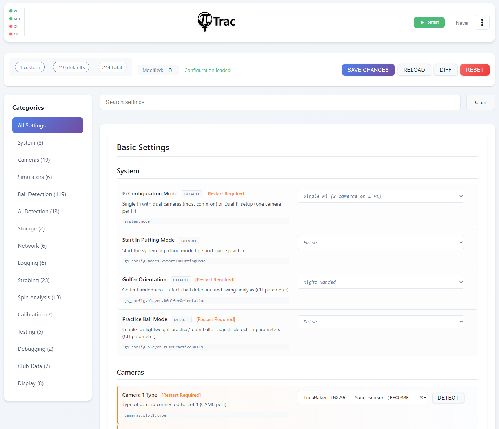

# Configuration

{ loading=lazy }

The Configuration page at `/config` is the central settings editor. No more editing 1000+ line JSON files.

## First-Time Setup

When you first open Configuration, there are a few critical settings you need to set before anything will work.

### Camera Hardware

**Camera 1 Type** and **Camera 2 Type** are the most important settings. PiTrac needs to know what cameras you're using.

- Click "Auto Detect" and PiTrac will try to identify your cameras.
- If that doesn't work (or picks the wrong ones), manually select from the dropdown:
    - **InnoMaker CAM-MIPI327RAW**, recommended camera
    - **Pi Global Shutter Camera**, also supported
    - Other options for older hardware

**Lens Choice**. Tell PiTrac what lenses you have:

- **6mm M12**, standard wide-angle lens (most common)
- **4mm M12**, wider field of view
- **8mm M12**, narrower field of view

After changing camera or lens settings, stop and restart PiTrac for the changes to take effect.

### Golfer Orientation

**Right-Handed** (default), for right-handed golfers.

**Left-Handed**, for left-handed golfers (experimental, may need tweaking).

## The Interface

**Status bar** (top):

- **Modified counter** shows how many settings have unsaved changes.
- **Save Changes** saves all modified settings (disabled when nothing has changed).
- **Reload** reloads configuration from disk.
- **Diff** shows differences between your settings and defaults.
- **Reset** resets all user settings to defaults (calibration data is preserved).

**Category sidebar** (left):

- Lists all setting categories with counts (e.g., "Cameras (42)").
- Includes an "All Settings" option at the top.
- Categories are defined in `configurations.json` and include: Cameras, Simulators, Ball Detection, AI Detection, Storage, Network, Logging, Strobing, Spin Analysis, Calibration, System, Testing, Debugging, Club Data, Display.

**Search bar** (top of settings panel):

- Type to filter settings by name. Much faster than clicking through categories.

**Settings editor** (main panel):

When viewing "All Settings" or a single category, settings are organized into **Basic** and **Advanced** sections. Each setting shows:

- Display name and description (from metadata)
- Current value with appropriate input control (text, number, boolean toggle, dropdown)
- `DEFAULT` badge if using the default value
- `[Restart Required]` indicator if changing the setting requires a PiTrac restart
- Configuration key path (e.g., `gs_config.cameras.kCamera1Gain`)
- Clear button (x) to reset individual settings to default

## Common Settings You'll Actually Change

### Camera Gains

**Path:** Cameras > kCamera1Gain / kCamera2Gain

**Range:** 0.5 to 16.0

**Default:** 6.0

Too dark? Increase gain (try 8-12). Too bright or noisy? Decrease gain (try 3-6).

Better lighting is always better than cranking gain. Higher gain means more noise.

### Simulator Connection

**Path:** Simulators > E6/GSPro sections

You'll need the IP address of the computer running your simulator software:

- **E6 Connect Address**, IP of PC running E6 (e.g., 192.168.1.100)
- **E6 Connect Port**, usually 2483
- **GSPro Host Address**, IP of PC running GSPro
- **GSPro Port**, usually 921

Use `ifconfig` (Mac/Linux) or `ipconfig` (Windows) on your simulator PC to find its IP.

!!! tip
    See the [Simulator Integration](../simulator-integration.md) page for detailed setup instructions for each simulator.

## Saving Changes

1. Edit whatever settings you need.
2. Click "Save Changes" at the top right.
3. If a setting requires restart, you'll see a warning.
4. Stop and start PiTrac to apply restart-required changes.

Most settings apply immediately. Camera hardware changes and a few others need a restart.

## Advanced Features

**Show Diff** shows what you've changed from the default values. Useful before resetting everything.

**Import/Export**. The configuration API supports exporting (`GET /api/config/export`) and importing (`POST /api/config/import`) your settings. Export includes both user settings and calibration data.

**Reset to Defaults** puts everything back to factory settings. Your calibration data is safe though. It's stored separately and won't be lost.

## What You Don't Need to Touch

PiTrac has hundreds of settings, but you only need to worry about maybe 30 of them. The rest are for fine-tuning ball detection algorithms, adjusting strobe timing, debugging, testing, etc.

Stick to the Basic category unless something's not working and you're troubleshooting. The defaults are there for a reason.

## Configuration Files (If You're Curious)

PiTrac uses a three-tier configuration system:

1. **Defaults**: built into `/usr/lib/pitrac/web-server/configurations.json` (settings with metadata)
2. **Calibration data**: auto-generated results in `~/.pitrac/config/calibration_data.json`
3. **Your overrides**: manual changes in `~/.pitrac/config/user_settings.json`

When you save changes through the web UI:

- Your overrides go to `user_settings.json` (sparse file, only what you changed).
- Calibration results go to `calibration_data.json` (preserved across resets).
- System generates `generated_golf_sim_config.json` by merging all three layers.

The `generated_golf_sim_config.json` file is what the `pitrac_lm` binary actually reads at runtime.

The layers merge in priority order: your overrides win over calibration which wins over defaults.

You can edit the JSON files directly if you want, but the web UI is easier and validates your input.
