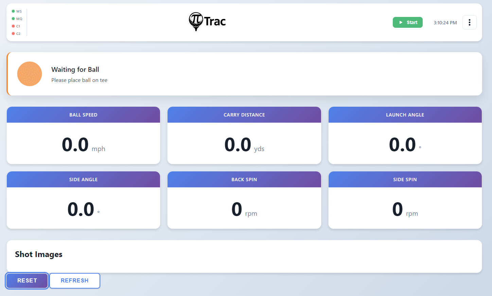

# Dashboard

{ loading=lazy }

The dashboard is the main page at `/`. It displays real-time shot data received via WebSocket.

## Status Strip

The status strip spans the top of the dashboard and shows the current system state. It changes color and message based on the `result_type` field from the C++ process:

| State | Color | Message |
|-------|-------|---------|
| System Stopped | Red | PiTrac is not running |
| System Initializing | Pulse | Starting up PiTrac system... |
| Waiting for Ball | Blue | Please place ball on tee |
| Waiting for Simulator | Blue | Waiting for simulator to be ready |
| Ball Detected | Amber | Waiting for ball to stabilize... |
| Ready to Hit! | Green | Ball is ready, take your shot |
| Ball Hit! | Green | Processing shot data... |
| Multiple Balls Detected | Red | Please remove extra balls |
| Error | Red | An error occurred |

When a hit is detected, a **Reset** button appears on the status strip. Clicking it calls `POST /api/reset` to clear the shot data and image.

## Metrics Panel

The left column shows shot metrics in a card layout:

- **Ball Speed** (hero card, large), displayed in mph
- **Launch Angle**, degrees
- **Side Angle**, degrees
- **Back Spin**, rpm
- **Side Spin**, rpm

Metrics animate briefly when updated. When PiTrac is not running, the metrics panel is dimmed (opacity 0.3).

## Shot Image Panel

The right column displays the shot image. When a shot is captured, the C++ process sends an image notification via `POST /api/internal/image-ready`, and the dashboard displays the image. Click the image to open it full-size in a new tab.

When no image is available, the panel shows "Hit a shot to see the image here."
