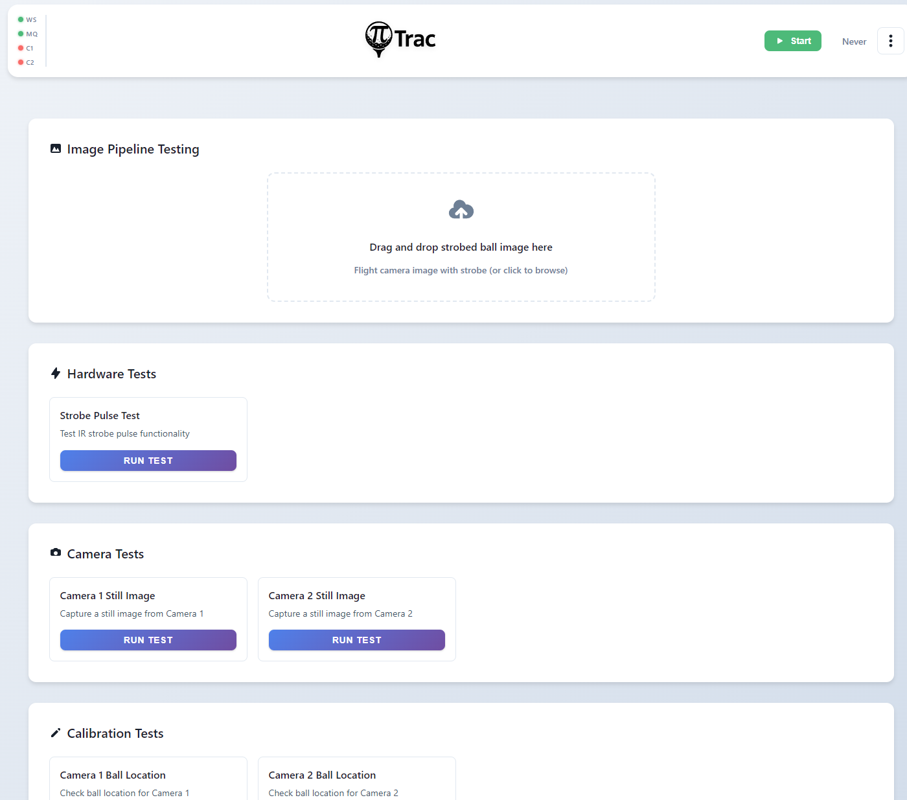

# Testing Tools

{ loading=lazy }

The Testing Tools page at `/testing` provides diagnostic and testing tools organized by category.

!!! note
    Testing tools cannot run while PiTrac is active. Stop PiTrac first. The system also enforces the strobe safety check before running any tool.

## Image Pipeline Testing

At the top of the page is an image upload area for testing the shot-processing pipeline:

- **Drag and drop** a strobed ball image, or click to browse.
- The upload hint reads: "Flight camera image with strobe (or click to browse)".
- After uploading, a preview appears with a "Remove" button.
- Click **Run Full Pipeline Test** to process the uploaded image through the complete detection pipeline.

Uploaded images are saved to `~/LM_Shares/TestImages/`.

## Tool Categories

Tools are populated dynamically from the server (`GET /api/testing/tools`) and displayed as cards in a grid. Each tool card has a **Run** button, and running tools show a **Stop** button. The defined tools are:

**Hardware Tests:**

| Tool | Description |
|------|-------------|
| Strobe Pulse Test | Test IR strobe pulse functionality (runs continuously for 60 seconds) |

**Camera Tests:**

| Tool | Description |
|------|-------------|
| Camera 1 Still Image | Capture a still image from Camera 1 |
| Camera 2 Still Image | Capture a still image from Camera 2 |

**Calibration Tests:**

| Tool | Description |
|------|-------------|
| Camera 1 Ball Location | Check ball location for Camera 1 |
| Camera 2 Ball Location | Check ball location for Camera 2 |

**Testing Suite:**

| Tool | Description |
|------|-------------|
| Test Uploaded Image | Run full pipeline on uploaded flight camera image |
| Test with Sample Images | Run detection on test images from the test suite |
| Automated Test Suite | Run full automated testing suite |

**Connectivity Tests:**

| Tool | Description |
|------|-------------|
| Test GSPro Server | Test GSPro server connectivity |

## Output Panel

Below the tool categories, a **Test Output** panel displays results from the last tool run. It includes a **Clear** button. A modal dialog can also display detailed test results.
